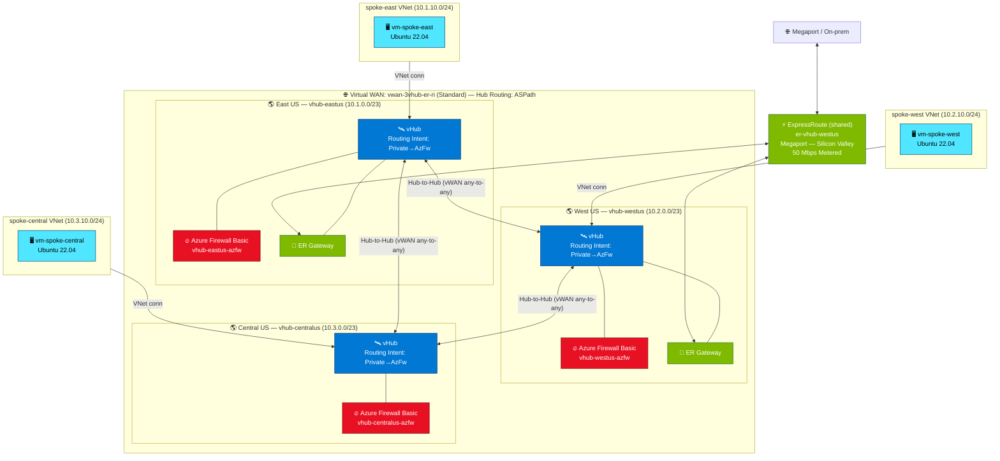

# Lab — 3-Region Virtual WAN with ExpressRoute, Azure Firewall Basic & Routing Intent (ASPath)

## Intro

This lab deploys a three-region Azure Virtual WAN topology with **ExpressRoute connectivity on two hubs sharing a single Megaport circuit** (Silicon Valley) — both the East-US and West-US vHub ER gateways peer with the same `er-vhub-westus` circuit — plus **Azure Firewall Basic** on all three hubs and **Routing Intent (private traffic only)** enforced across the entire fabric. Hub routing preference is set to **ASPath** on all three virtual hubs so that the shortest BGP AS-path wins when equal-cost routes are learned from ExpressRoute, VPN, and spoke connections — giving deterministic forwarding in a multi-hub, multi-region topology.

The deployment is a single interactive script that pauses after printing the ER service key so you can hand it to Megaport, then polls `serviceProviderProvisioningState` until the circuit is `Provisioned` before wiring everything together.

## Network Topology




| Component | East US | West US | Central US |
|-----------|---------|---------|------------|
| vHub name | `vhub-eastus` | `vhub-westus` | `vhub-centralus` |
| Hub address | 10.1.0.0/23 | 10.2.0.0/23 | 10.3.0.0/23 |
| Spoke VNet | `spoke-east` 10.1.10.0/24 | `spoke-west` 10.2.10.0/24 | `spoke-central` 10.3.10.0/24 |
| Spoke VM | `vm-spoke-east` | `vm-spoke-west` | `vm-spoke-central` |
| ER circuit | `er-vhub-westus` (Silicon Valley) — **shared** | `er-vhub-westus` (Silicon Valley) — **shared** | — |
| Azure Firewall | `vhub-eastus-azfw` (Basic) | `vhub-westus-azfw` (Basic) | `vhub-centralus-azfw` (Basic) |
| Routing Intent | Private only | Private only | Private only |

## Considerations

- **Single shared ExpressRoute circuit**: To reduce cost and provider footprint, both regional ER gateways (`vhub-eastus-ergw` and `vhub-westus-ergw`) attach to **one** Megaport circuit (`er-vhub-westus`, Silicon Valley) via its `AzurePrivatePeering`. This works because Virtual WAN routes hub-to-hub traffic over the Microsoft backbone, so the East-US hub does not need a locally-homed ER peering location. If you require local ER ingress per region for latency or sovereignty reasons, add a second circuit and a second peering location.

- **Routing-Intent–compatible ER gateway connections**: ER gateway connections on a hub that has Routing Intent enabled must be created **without** `--associated-route-table`, `--propagated-route-tables`, or `--labels` — otherwise Azure returns `ConnectionRoutingConfigConflictsWithRoutingIntent`. Routing Intent then populates the connection's effective routing config automatically (associated = `defaultRouteTable`, propagated = `noneRouteTable`, labels = `none`). The deploy script follows this pattern.

- **Defender for Servers auto-instrumentation**: If the target subscription has a Microsoft Defender for Servers (Plan 2) policy enabled, the `MDE.Linux` extension is automatically installed on the spoke VMs after creation. This is enforced by Azure Policy outside the lab script and is informational only — no action required.

- **Azure Firewall Basic SKU limitations**: Basic tier does not support Threat Intelligence (IDPS), TLS inspection, or advanced SNAT. For labs requiring those features use Standard or Premium. Basic is appropriate here because the goal is Routing Intent traffic steering, not deep inspection.

- **Routing Intent — private only**: This lab routes only private (RFC-1918) traffic through the firewall. Internet-bound traffic from spokes is **not** steered through AzFw Basic — Basic tier has restrictions on internet traffic inspection in the vHub Secured-Hub model. If you need internet egress via the firewall, upgrade to Standard or Premium SKU.

- **Hub routing preference = ASPath**: All three vHubs are created with `--hub-routing-preference ASPath`. This means the vHub router prefers routes with the shortest BGP AS-path when multiple equal-cost paths exist (e.g., from ER and VPN). This is the recommended setting for multi-region topologies with ExpressRoute, as it provides more predictable routing than the VpnGateway or ExpressRoute preferences.

- **VM SKU pre-flight check**: Before creating any resources, the deploy script checks each spoke region (`eastus`, `westus`, `centralus`) for VM SKU restrictions and selects the first available candidate from `Standard_B2s`, `Standard_D2s_v5`, `Standard_D2s_v3`. If none are available in a region, the script exits before deployment starts.

- **ExpressRoute provisioning requires a real provider order**: The deploy script creates the ER circuit early, prints its service key, and pauses so you can place the Megaport VXC order. It then overlaps vHub/spoke deployment with provider provisioning and polls `serviceProviderProvisioningState` later, immediately before ER gateway creation. Provider provisioning typically takes **hours to days**. The script polls with a configurable timeout (`MAX_WAIT_MIN=180`). If the timeout is reached, re-run the script from Phase 8 onward after the circuit becomes `Provisioned`.

- **Cost note**: This lab runs three Standard vWAN hubs, one ExpressRoute Standard circuit, and three Azure Firewall Basic instances simultaneously. Costs are non-trivial — ensure you run `3vhub-er-ri-cleanup.azcli` when the lab is complete.

## Default Parameters

```bash
# Variables (make changes based on your requirements)
rg=lab-3vhub-er-ri                  # resource group
vwanname=vwan-3vhub-er-ri            # virtual WAN name
region1=eastus                       # hub 1 region
region2=westus                       # hub 2 region
region3=centralus                    # hub 3 region
hub1name=vhub-eastus                 # hub 1 name
hub2name=vhub-westus                 # hub 2 name
hub3name=vhub-centralus              # hub 3 name
hub1prefix=10.1.0.0/23               # hub 1 address space
hub2prefix=10.2.0.0/23               # hub 2 address space
hub3prefix=10.3.0.0/23               # hub 3 address space
spoke1prefix=10.1.10.0/24            # spoke 1 address space
spoke2prefix=10.2.10.0/24            # spoke 2 address space
spoke3prefix=10.3.10.0/24            # spoke 3 address space
username=azureuser                   # VM admin username
VM_SKU_CANDIDATES=(Standard_B2s Standard_D2s_v5 Standard_D2s_v3) # VM size candidates, in preference order
ername=er-vhub-westus                # ER circuit name (shared by East + West hubs)
perloc="Silicon Valley"              # ER peering location
erprovider=Megaport                  # ER provider
erbandwidth=50                       # ER bandwidth (Mbps)
ersku=Standard / erfamily=MeteredData
firewallsku=Basic                    # Azure Firewall tier
MAX_WAIT_MIN=180                     # ER provisioning poll timeout (minutes)
```

**Note:** The deployment will take approximately 45–65 minutes for the Azure infrastructure phases (excluding any remaining ExpressRoute provider provisioning wait, which can be hours to days). The script overlaps ER circuit creation/provider handoff with vHub and spoke work to maximize wall-clock efficiency.

## Deploy This Solution

Open [Azure Cloud Shell (Bash)](https://shell.azure.com) or a local terminal with Azure CLI installed and run:

```bash
wget -O 3vhub-er-ri-deploy.sh https://raw.githubusercontent.com/dmauser/azure-virtualwan/main/3vhub-er-ri/3vhub-er-ri-deploy.azcli
chmod +x 3vhub-er-ri-deploy.sh
./3vhub-er-ri-deploy.sh
```

### Extra Steps After Deployment

1. **ER service-key handoff to Megaport**: The deploy script prints the circuit service key early and pauses. Copy the key into the Megaport portal to create one VXC (Virtual Cross Connect) to the Silicon Valley Microsoft location, then press ENTER after the order is placed. The script continues independent Azure work and later waits for `serviceProviderProvisioningState = Provisioned` before ER gateway creation.

2. **Resume after poll timeout**: If you hit the `MAX_WAIT_MIN=180` timeout (provider provisioning is slow), the script exits with a resume hint. Once the circuit is `Provisioned`, you can manually run the remaining phases (Phase 8 onward) from the deploy script, adjusting the variable block at the top as needed.

3. **Validate routing**: After deployment completes, SSH to any VM and run `traceroute` to private IPs in other spokes. All cross-region and on-premises traffic should traverse the Azure Firewall in each hub due to Routing Intent.

## Validate

```bash
wget -O 3vhub-er-ri-validate.sh https://raw.githubusercontent.com/dmauser/azure-virtualwan/main/3vhub-er-ri/3vhub-er-ri-validate.azcli
chmod +x 3vhub-er-ri-validate.sh
./3vhub-er-ri-validate.sh
```

The validate script checks:
- VM public and private IPs
- VM effective routes
- vHub effective route tables (all 3 hubs)
- Azure Firewall effective routes per hub
- `hubRoutingPreference = ASPath` on all 3 hubs
- ER circuit and connection provisioning state
- Routing Intent provisioning state per hub
- SSH connectivity test hints

## Cleanup

```bash
wget -O 3vhub-er-ri-cleanup.sh https://raw.githubusercontent.com/dmauser/azure-virtualwan/main/3vhub-er-ri/3vhub-er-ri-cleanup.azcli
chmod +x 3vhub-er-ri-cleanup.sh
./3vhub-er-ri-cleanup.sh
```

> ⚠️ Deleting the resource group also deletes the ExpressRoute circuit. Ensure you have removed the Megaport VXC before cleanup to avoid orphaned charges on the provider side.
