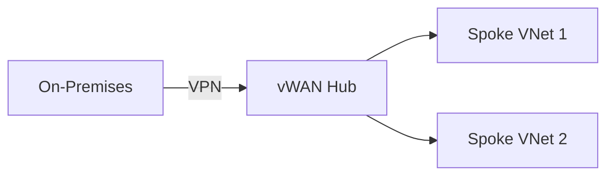

# Lab: {Title}

## Objectives

- What the user will learn
- Key Azure networking concept demonstrated
- Specific routing/security behavior explored

## Architecture


<!-- Alternative: use a Mermaid diagram -->
<!--

-->

## Prerequisites

- Azure subscription with sufficient quota
- Azure CLI with `virtual-wan` extension installed
- Estimated cost: $X/hour (adjust based on resources deployed)

## Estimated Deployment Time

~XX minutes

## Deployment Steps

1. Clone this repository and navigate to the lab folder:
   ```bash
   cd azure-virtualwan/{lab-folder}
   ```

2. Review and customize the parameters at the top of the deploy script:
   ```bash
   code {prefix}-deploy.azcli
   ```

3. Run the deployment script:
   ```bash
   bash {prefix}-deploy.azcli
   ```

4. (Optional) Additional configuration steps...

## Validation

How to verify the deployment worked:

- Check effective routes on the Virtual Hub:
  ```bash
  az network vhub get-effective-routes -g {rg} -n {hubname} ...
  ```
- Test connectivity between spokes:
  ```bash
  az vm run-command invoke -g {rg} -n {vmname} --command-id RunShellScript \
    --scripts "ping -c 4 {target-ip}"
  ```

## Cleanup

```bash
az group delete -n {resource-group} --yes --no-wait
```

## Troubleshooting

| Issue | Possible Cause | Solution |
|-------|---------------|----------|
| Hub stuck in "Provisioning" | Concurrent operations | Wait 10-15 min, check Activity Log |
| No effective routes | VNet connection not associated | Verify route table associations |
| VPN tunnel down | Pre-shared key mismatch | Compare PSK on both sides |

## References

- [Azure Virtual WAN documentation](https://learn.microsoft.com/azure/virtual-wan/)
- Related labs in this repo: [link to related lab]
