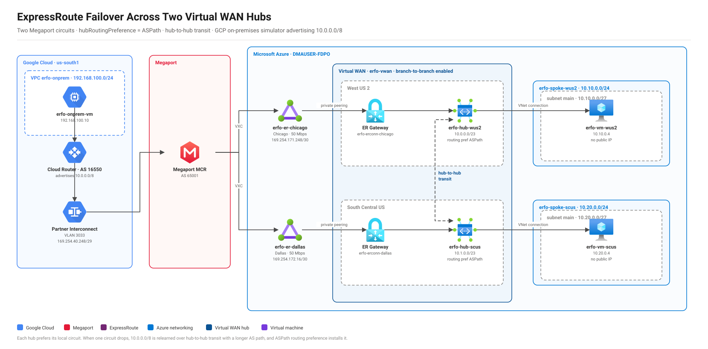

# ExpressRoute Failover Across Two Virtual WAN Hubs

A lab that validates **ExpressRoute failover between two Azure regions** using Virtual WAN hub-to-hub transit and `ASPath` hub route preference.

Each hub has its own local ExpressRoute circuit. When a circuit goes down, the hub behind it should keep reaching on-premises **through the other hub's circuit**. That reroute is what this lab exists to prove.

---

## Architecture



> Editable source: [`docs/diagrams/er-failover-architecture.drawio`](docs/diagrams/er-failover-architecture.drawio) — open it in [draw.io](https://app.diagrams.net) or the VS Code *Draw.io Integration* extension. It uses the stock Azure and Google Cloud icon libraries, so the artwork stays on-brand when you edit it. Both this SVG and the `.drawio` are generated by [`docs/diagrams/gen_diagram.py`](docs/diagrams/gen_diagram.py) — edit the generator and re-run `python gen_diagram.py`, rather than hand-editing the outputs.

---

## Topology

```mermaid
flowchart LR
    subgraph gcp["GCP — us-south1 · on-premises simulator"]
        GVM["erfo-onprem-vm<br/>10.100.0.10"]
        GSUB["subnet<br/>10.100.0.0/24"]
        GCR["Cloud Router<br/>erfo-onprem-router<br/>ASN 16550<br/>advertises 10.0.0.0/8"]
        GATT["VLAN attachment<br/>erfo-onprem-attach<br/>Partner Interconnect"]
    end

    subgraph onprem["Megaport"]
        MCR["Megaport MCR<br/>ASN 16550 ⇄ GCP<br/>ASN 65001 ⇄ Azure"]
    end

    subgraph circuits["ExpressRoute circuits"]
        ERC["erfo-er-chicago<br/>North Central US<br/>50 Mbps"]
        ERD["erfo-er-dallas<br/>South Central US<br/>50 Mbps"]
    end

    subgraph vwan["erfo-vwan — Virtual WAN (Standard)"]
        subgraph wus2["West US 2"]
            GWC["ER Gateway<br/>erfo-hub-wus2-ergw"]
            HUBC["erfo-hub-wus2<br/>10.0.0.0/23<br/>routing pref: ASPath"]
            SPC["erfo-spoke-wus2<br/>10.10.0.0/24"]
            VMC["erfo-vm-wus2<br/>10.10.0.4"]
        end
        B2B{{"branch-to-branch<br/>hub-to-hub transit"}}
        subgraph scus["South Central US"]
            GWS["ER Gateway<br/>erfo-hub-scus-ergw"]
            HUBS["erfo-hub-scus<br/>10.1.0.0/23<br/>routing pref: ASPath"]
            SPS["erfo-spoke-scus<br/>10.20.0.0/24"]
            VMS["erfo-vm-scus<br/>10.20.0.4"]
        end
    end

    GVM --- GSUB --- GCR --- GATT
    GATT -->|"VXC 1"| MCR
    MCR -->|"VXC 2 · Chicago"| ERC
    MCR -->|"VXC 3 · Dallas"| ERD
    ERC --- GWC --- HUBC --- SPC --- VMC
    ERD --- GWS --- HUBS --- SPS --- VMS
    HUBC -.- B2B
    HUBS -.- B2B

    classDef gcpc fill:#e8f0fe,stroke:#4285f4,color:#1b1b1b
    classDef edge fill:#fde7e9,stroke:#e31937,color:#1b1b1b
    classDef ckt fill:#e5f1fb,stroke:#0078d4,color:#1b1b1b
    classDef gw fill:#cfe4f7,stroke:#0078d4,color:#1b1b1b
    classDef hub fill:#dbe9f7,stroke:#0b5394,color:#1b1b1b
    classDef vm fill:#ede4fb,stroke:#773adc,color:#1b1b1b
    classDef transit fill:#fff4ce,stroke:#8a6d00,color:#1b1b1b
    class GVM,GSUB,GCR,GATT gcpc
    class MCR edge
    class ERC,ERD ckt
    class GWC,GWS gw
    class HUBC,HUBS hub
    class SPC,SPS,VMC,VMS vm
    class B2B transit
```



| Resource | Region | Address space |
|---|---|---|
| `erfo-hub-wus2` | West US 2 | `10.0.0.0/23` |
| `erfo-hub-scus` | South Central US | `10.1.0.0/23` |
| `erfo-spoke-wus2` | West US 2 | `10.10.0.0/24` (subnet `10.10.0.0/27`) |
| `erfo-spoke-scus` | South Central US | `10.20.0.0/24` (subnet `10.20.0.0/27`) |
| `erfo-er-chicago` | North Central US | Chicago peering, Megaport → **West US 2 hub** |
| `erfo-er-dallas` | South Central US | Dallas peering, Megaport → **South Central US hub** |

No Azure Firewall and no Routing Intent. Plain hubs keep the AS-path selection behavior unambiguous and avoid roughly $600/month in firewall cost.

---

## Why `ASPath`

`hubRoutingPreference` controls how a Virtual Hub picks between routes for the same prefix.

| Setting | Selection order |
|---|---|
| `ExpressRoute` (default) | ER routes win over VPN/NVA regardless of AS path |
| `VpnGateway` | VPN routes win |
| **`ASPath`** | **Shortest BGP AS path wins first, source is only a tiebreak** |

With `ASPath`:

- **Steady state** — each hub learns on-prem prefixes directly from its local circuit (shortest AS path) and uses it.
- **Failure** — when the local circuit drops, the surviving path arrives via the *other* hub over branch-to-branch transit. Its AS path is longer, so it was previously losing; now it is the only path and gets installed.

`allowBranchToBranchTraffic: true` on the Virtual WAN is **mandatory** — without it the hubs never re-advertise each other's ExpressRoute routes and there is nothing to fail over to.

---

## Prerequisites

| Requirement | Why |
|---|---|
| Azure CLI with the Bicep extension | Deployment |
| `Microsoft.ContainerInstance` registered on the subscription | Only needed for the provider-wait poller, which runs as a `deploymentScripts` container. Not required when deploying with `--skip-provider-wait` |
| Owner or User Access Administrator on the resource group | Only needed for the poller — creates its identity's Reader role assignment. Set `createRoleAssignment=false` to opt out and pre-assign it yourself |
| A Megaport (or other provider) account able to order VXCs in Chicago and Dallas | The circuits are useless until the provider provisions them |

Register the container provider once:

```bash
az provider register --namespace Microsoft.ContainerInstance --wait
```

---

## Deploy

The deployment runs in **one shot** but deliberately parks in the middle while you order circuits with your provider.

### 1. Start the deployment

```bash
RG=rg-er-failover-lab
az group create -n $RG -l centralus

cd er-failover-dual-hub/infra/bicep

az deployment group create \
  --resource-group $RG \
  --name er-failover \
  --template-file main.bicep \
  --parameters main.bicepparam \
  --parameters adminPassword='<strong-password>'
```

Or use the wrapper:

```bash
./scripts/deploy.sh -g rg-er-failover-lab
```

```powershell
.\scripts\deploy.ps1 -ResourceGroup rg-er-failover-lab
```

### 2. Collect the service keys — *while the deployment is still running*

The `serviceKeys` output only materializes once the whole deployment finishes, and the deployment will not finish until the circuits are provisioned. So read the keys directly off the circuits:

```bash
./scripts/get-service-keys.sh -g rg-er-failover-lab
```

```powershell
.\scripts\get-service-keys.ps1 -ResourceGroup rg-er-failover-lab
```

Both print each circuit's name, peering location, bandwidth, **service key**, and current provider state.

### 3. Order the VXCs

In the Megaport portal, create one VXC per circuit against the matching service key:

| Circuit | Megaport location | Terminates on |
|---|---|---|
| `erfo-er-chicago` | Chicago | West US 2 hub |
| `erfo-er-dallas` | Dallas | South Central US hub |

### 4. Let the deployment finish

Each circuit has its own poller checking `serviceProviderProvisioningState` every 60 seconds. As soon as a circuit flips to `Provisioned`, its ExpressRoute connection to the local hub is created automatically.

Watch progress:

```bash
watch -n 30 './scripts/get-service-keys.sh -g rg-er-failover-lab'
```

Default deadline is **110 minutes per circuit** (`waitTimeoutSeconds`). If your provider turnaround is slower, raise it before deploying.

### Skipping the wait gate

The poller runs as a `deploymentScripts` container, which mounts an auto-created storage account **using shared keys**. Subscriptions that enforce `allowSharedKeyAccess = false` block this outright (`KeyBasedAuthenticationNotPermitted`). The same applies if you simply already have both circuits provisioned and want to re-run the deployment.

Deploy with the gate off:

```bash
./scripts/deploy.sh -g rg-er-failover-lab --skip-provider-wait
```

```powershell
.\scripts\deploy.ps1 -ResourceGroup rg-er-failover-lab -SkipProviderWait
```

This sets `waitForProvider=false`, which removes the pollers and their managed identity from the template and creates the ExpressRoute connections immediately. **Confirm both circuits report `Provisioned` first** — nothing is gating them any more. See [docs/troubleshooting.md](docs/troubleshooting.md).

### Redeploying against provisioned circuits

Once a circuit has a live peering bound to a provider link, re-PUTting the circuit
resource fails with `ConflictError: The specified bgp peering is in use` — and takes
the peering down with it. Any redeploy after the circuits are up should therefore
disable circuit management:

```bash
./scripts/deploy.sh -g rg-er-failover-lab --skip-provider-wait --skip-circuits
```

```powershell
.\scripts\deploy.ps1 -ResourceGroup rg-er-failover-lab -Location centralus `
  -AdminPassword $pw -SkipProviderWait -SkipCircuits
```

`--skip-circuits` sets `manageCircuits=false`. The template then reads the circuits
as `existing` resources instead of declaring them, so their ARM bodies are never
rewritten. Everything else — hubs, spokes, VMs, gateways, **peerings and ExpressRoute
connections** — still deploys normally, which makes this the right way to add a
missing peering or connection to an already-provisioned lab.

Treat `--skip-provider-wait --skip-circuits` as the standard flag pair for every
redeploy after the initial build.

---

## Private peering

**The connectivity provider owns `AzurePrivatePeering`. This lab never writes it.**

Both circuits terminate on a Megaport **MCR**, which runs BGP on the Megaport
side. When the ExpressRoute VXC is provisioned, Megaport pushes the peering onto
the circuit — peer ASN, VLAN, and both `/30` link subnets included. The Bicep
only *reads* it:

- `er-wait.bicep` polls until the peering exists (`requirePrivatePeering = true`)
- `er-circuit-info.bicep` returns its resource ID
- `er-connection.bicep` binds the ER connection to that ID

Megaport-assigned link subnets in this lab:

| Circuit | Primary `/30` | Secondary `/30` |
|---|---|---|
| `erfo-er-chicago` | `169.254.171.248/30` | `169.254.171.252/30` |
| `erfo-er-dallas` | `169.254.172.16/30` | `169.254.172.20/30` |

> Do not set the peering from Bicep or the CLI. Overwriting the provider's
> addressing drops the live BGP sessions, and re-`PUT`ting a circuit whose
> peering is in use fails with `ConflictError` and leaves the circuit `Failed`.

---

## Accessing the test VMs

The VMs have **no public IP**. That is deliberate: a public IP would keep
working while the ExpressRoute path you are testing is broken, which hides the
outage you are trying to observe. Access rides the Azure control plane instead:

```bash
az extension add --name serial-console    # one time
az serial-console connect -g rg-er-failover-lab -n erfo-vm-scus
```

Log in with `azureuser` and the `adminPassword` you deployed with. The exact
commands for both VMs are in the `serialConsoleCommands` deployment output.

Requirements:

- **Virtual Machine Contributor** (or higher) on the VM. Reader is not enough.
- Managed boot diagnostics, which the template enables — no storage account and
  no shared-key access needed.
- Password authentication in the guest. The template keeps it on, because
  Serial Console has no SSH key exchange.

SSH also works from anywhere in private space — the other spoke, or on-premises
over either circuit — since the NSG allows RFC1918 inbound. Just remember an SSH
session riding ExpressRoute will drop when you break that circuit.

---

## GCP on-premises simulator

Failover is only observable from *outside* Azure, so the lab ships an optional on-premises site in Google Cloud: one `e2-micro` Linux VM behind a Partner Interconnect VLAN attachment in `us-south1` (physically Dallas).

```
                                               ┌──▶ erfo-er-chicago ──▶ erfo-hub-wus2
erfo-onprem-vm ──▶ erfo-onprem-router ──▶ MCR ─┤
                                               └──▶ erfo-er-dallas  ──▶ erfo-hub-scus
  10.100.0.10      ASN 16550           ASN 65001
  10.100.0.0/24    advertises 10.0.0.0/8
```

The two hubs also reach each other over branch-to-branch transit, which is what
lets the surviving circuit carry traffic for the region whose circuit went down.

Megaport is Layer 2, so it cannot bridge a GCP attachment straight onto an ExpressRoute circuit. An **MCR** sits in the middle running BGP on both sides — ASN `16550` toward GCP (a GCP requirement for Partner Interconnect) and `65001` toward Azure.

The GCP router advertises `ALL_SUBNETS` plus the supernet **`10.0.0.0/8`**. Every Azure prefix is a longer match inside that `/8`, so intra-Azure routing is unaffected — but it gives you a single prefix whose next hop visibly swings from `erfo-hub-scus` (Dallas) to `erfo-hub-wus2` (Chicago, via hub-to-hub transit) when the primary circuit drops. That swing is exactly what `hubRoutingPreference = ASPath` acts on.

```bash
cd scripts
./gcp-deploy.sh   -p my-gcp-project     # prints the pairing key for Megaport
./gcp-validate.sh -p my-gcp-project
./gcp-cleanup.sh  -p my-gcp-project
```

```powershell
cd scripts
.\gcp-deploy.ps1   -Project my-gcp-project
.\gcp-validate.ps1 -Project my-gcp-project
.\gcp-cleanup.ps1  -Project my-gcp-project
```

The VM has **no external IP** — reach it with `gcloud compute ssh erfo-onprem-vm --zone=us-south1-a --tunnel-through-iap`.

> **Cost warning.** The VLAN attachment bills **per hour from creation** (~$0.05–0.10/hr) regardless of whether the VXC exists or any traffic flows. *Stopping the VM does not stop it* — only deleting the attachment does. Megaport MCR and VXC charges are separate again.

Full walkthrough, MCR wiring, attachment state machine and troubleshooting: **[docs/gcp-onprem.md](docs/gcp-onprem.md)**.

---

## Dumping routes from every point in the path

Failover is a routing event, so the fastest way to prove it happened is to
capture every route table before and after. `dump-routes` does that in one pass
and is **read-only** — safe to run at any time.

```bash
cd scripts
./dump-routes.sh -g rg-er-failover-dual-hub --label before-failover
```

```powershell
cd scripts
.\dump-routes.ps1 -ResourceGroup rg-er-failover-dual-hub -Label before-failover
```

It collects four sections:

| Section | What it captures |
|---|---|
| **ExpressRoute circuits** | Private peering config, BGP neighbour summary, learned routes and ARP tables — primary *and* secondary path, both circuits |
| **Virtual hub effective routes** | Each hub's `defaultRouteTable`, plus effective routes per ExpressRoute connection and per spoke VNet connection |
| **Azure VM routes** | In-guest kernel route table via `az vm run-command` (the VMs have no public IP, so there is no SSH path from your workstation) |
| **GCP on-premises** | Cloud Router BGP status, advertised and learned routes, VPC routes, the VLAN attachment, and the on-prem VM's kernel table over IAP |

Output lands in `route-dumps/<UTC timestamp>[-label]/` as individual `.json` /
`.txt` files plus a combined `report.txt`, and is echoed to the console.

The intended workflow is a diff:

```bash
./dump-routes.sh -g rg-er-failover-dual-hub --label before
# ...break the Dallas circuit...
./dump-routes.sh -g rg-er-failover-dual-hub --label after
diff -u ../route-dumps/*-before/report.txt ../route-dumps/*-after/report.txt
```

Watch `10.0.0.0/8` in that diff — its next hop is the thing that moves.

Useful flags:

| Flag | Effect |
|---|---|
| `--skip-vms` / `-SkipVms` | Skip in-guest dumps. These are the slow part (~30–60 s per VM) |
| `--skip-gcp` / `-SkipGcp` | Control-plane-only look at the Azure side |
| `--label` / `-Label` | Tag folded into the folder name |
| `-p` / `-GcpProject` | GCP project; falls back to `$GCP_PROJECT` then `gcloud config` |

> The in-guest sections need both VMs **running**. Auto-shutdown deallocates them
> nightly — the script emits a warning rather than failing if a VM is stopped.

---

## Validate failover

See **[docs/failover-tests.md](docs/failover-tests.md)** for the full procedure. The short version:

1. From `erfo-vm-scus`, start a continuous `mtr` to an on-prem address.
2. Confirm the path exits via the **Dallas** circuit.
3. Disable the Dallas circuit's BGP session.
4. Traffic should re-converge over **West US 2 hub → Chicago** within seconds.
5. Re-enable, confirm it fails back.

---

## Cost

Rough monthly estimate, US pricing, lab left running:

| Item | Qty | Approx. |
|---|---|---|
| Virtual WAN hub | 2 | ~$180 |
| ExpressRoute Gateway (1 scale unit) | 2 | ~$500 |
| ExpressRoute circuit (50 Mbps, Metered) | 2 | ~$110 |
| `Standard_B1s` VM | 2 | ~$15 |
| Standard HDD OS disk (30 GB) | 2 | ~$3 |
| **Total** | | **~$810/mo** |

Megaport VXC charges are separate and billed by Megaport. Tear down with `scripts/cleanup.sh` when you are done.

### Keeping VM cost down

The test VMs only emit ping, traceroute and mtr, so the defaults are deliberately minimal:

| Setting | Default | Why |
|---|---|---|
| `vmSize` | `Standard_B1s` | Cheapest size that runs Ubuntu 22.04 comfortably (~$7.50/mo each) |
| `osDiskType` | `Standard_LRS` | Standard HDD, ~$1.50/mo for 30 GB. Override to `StandardSSD_LRS` if boot latency bothers you |
| `enableAutoShutdown` | `true` | Deallocates both VMs nightly at `autoShutdownTime` (default `2300` UTC) |
| Public IP | none | No public IP means no IP-hour charge and no egress path to the internet |

Auto-shutdown deallocates the VM, which stops compute billing; the OS disk keeps billing. Restart before a test run:

```bash
az vm start -g rg-er-failover-dual-hub -n erfo-vm-wus2
az vm start -g rg-er-failover-dual-hub -n erfo-vm-scus
```

Disable the schedule with `-p enableAutoShutdown=false`, or shift it with `-p autoShutdownTime=0300 -p autoShutdownTimeZone='Central Standard Time'`.

The VMs are rounding error next to the two ExpressRoute Gateways, which are ~60% of the bill and cannot be paused — only deleted. If the lab is idle for more than a few days, run `scripts/cleanup.sh`.

---

## Documentation

| Doc | Contents |
|---|---|
| [docs/architecture.md](docs/architecture.md) | Address plan, route propagation, AS-path selection detail |
| [docs/failover-tests.md](docs/failover-tests.md) | Step-by-step failover validation |
| [docs/troubleshooting.md](docs/troubleshooting.md) | Poller, peering, RBAC and routing issues |
| [docs/gcp-onprem.md](docs/gcp-onprem.md) | GCP on-prem simulator: MCR wiring, `10.0.0.0/8` rationale, cost |
| [docs/findings.md](docs/findings.md) | What the live route captures actually showed, and what to fix |
| [docs/diagrams/](docs/diagrams/) | `gen_diagram.py` plus the generated `.drawio` (editable) and `.svg` (embedded above) |

### Scripts

All scripts live in `scripts/` and ship as PowerShell/bash twins with identical
behaviour. Run them **from inside `scripts/`** — they resolve the Bicep templates
relative to their own location.

| Script | Purpose |
|---|---|
| `deploy` | Deploy or redeploy the Azure side. `--skip-provider-wait --skip-circuits` is the standard pair after the initial build |
| `get-service-keys` | Print each circuit's service key, peering location, bandwidth and provider state — hand these to Megaport |
| `validate` | Assert the deployed topology: hubs, `ASPath`, branch-to-branch, gateways, connections, no public IPs, boot diagnostics |
| `dump-routes` | Read-only route capture from circuits, hubs, VMs and GCP into a timestamped folder for before/after diffing |
| `cleanup` | Delete the Azure resource group |
| `gcp-deploy` | Build the GCP on-prem simulator and print the pairing key for Megaport |
| `gcp-validate` | Check the attachment state, Cloud Router BGP session and advertised prefixes |
| `gcp-cleanup` | Delete the GCP side — **the only thing that stops the hourly attachment charge** |

---

## Layout

```
er-failover-dual-hub/
├── README.md
├── docs/
│   ├── architecture.md
│   ├── failover-tests.md
│   ├── gcp-onprem.md
│   ├── findings.md
│   ├── troubleshooting.md
│   └── diagrams/
│       ├── er-failover-architecture.drawio   # editable source (Azure + GCP icon libraries)
│       ├── er-failover-architecture.svg      # embedded in README and docs/architecture.md
│       ├── gen_diagram.py                    # generates both artifacts — edit this, not the outputs
│       └── icons_data.py                     # inlined Azure/GCP vector artwork used by the SVG
├── infra/bicep/
│   ├── main.bicep
│   ├── main.bicepparam
│   ├── modules/
│   │   ├── vwan.bicep
│   │   ├── vhub.bicep
│   │   ├── spoke-vnet.bicep
│   │   ├── linux-vm.bicep
│   │   ├── expressroute-circuit.bicep
│   │   ├── expressroute-gateway.bicep
│   │   ├── er-circuit-info.bicep
│   │   ├── er-connection.bicep
│   │   ├── er-wait.bicep
│   │   └── script-identity.bicep
│   └── scripts/
│       └── wait-for-er-provisioned.sh
└── scripts/
    ├── deploy.sh / deploy.ps1
    ├── get-service-keys.sh / get-service-keys.ps1
    ├── validate.sh / validate.ps1
    ├── dump-routes.sh / dump-routes.ps1      # read-only route capture
    ├── cleanup.sh / cleanup.ps1
    ├── gcp-deploy.sh / gcp-deploy.ps1        # GCP on-prem simulator
    ├── gcp-validate.sh / gcp-validate.ps1
    └── gcp-cleanup.sh / gcp-cleanup.ps1
```
