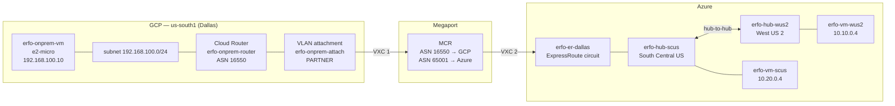

# GCP on-premises simulator

This lab needs an "on-premises" site that reaches Azure over ExpressRoute so the
failover between the two Virtual WAN hubs is observable from outside Azure. That
site is a small Google Cloud environment: one Linux VM behind a Partner
Interconnect VLAN attachment.

Everything here is deployed with the `gcloud` CLI (`scripts/gcp-*.sh` /
`scripts/gcp-*.ps1`). It is intentionally separate from the Azure Bicep so you
can build, break and delete the on-prem side without touching the vWAN.

---

## Architecture



Megaport is a Layer 2 provider. It **cannot** bridge a GCP Partner Interconnect
attachment straight onto an Azure ExpressRoute circuit with a single VXC — the
two clouds each expect to speak BGP to the provider, not to each other. An
**MCR** (Megaport Cloud Router) sits in the middle and terminates both:

| VXC | From | To | BGP |
|-----|------|----|-----|
| 1 | MCR | GCP `erfo-onprem-attach` | MCR uses ASN **16550** (GCP requirement) |
| 2 | MCR | Azure `erfo-er-dallas` | MCR uses ASN **65001** (matches the circuit's private peering) |

The MCR re-advertises between the two sessions. That is what makes the GCP VM
appear to Azure as a normal on-premises site.

---

## Address plan

| Item | Value |
|------|-------|
| GCP region / zone | `us-south1` / `us-south1-a` (physically Dallas) |
| VPC | `erfo-onprem` — custom subnet mode, global BGP routing, MTU 1460 |
| Subnet | `192.168.100.0/24`, Private Google Access on |
| VM | `erfo-onprem-vm`, `e2-micro`, Ubuntu 22.04, `192.168.100.10`, **no external IP** |
| Cloud Router ASN | **16550** (forced for Partner Interconnect) |
| Advertised | `ALL_SUBNETS` + `10.0.0.0/8` |
| Attachment | `erfo-onprem-attach`, `PARTNER`, `availability-domain-1` |
| Pairs with | `erfo-er-dallas` → `erfo-hub-scus` |

`192.168.100.0/24` was chosen because it does not collide with anything on the
Azure side:

| Azure prefix | Used by |
|---|---|
| `10.0.0.0/23` | `erfo-hub-wus2` hub |
| `10.1.0.0/23` | `erfo-hub-scus` hub |
| `10.10.0.0/24` | spoke `erfo-spoke-wus2` |
| `10.20.0.0/24` | spoke `erfo-spoke-scus` |
| `169.254.172.16/30`, `.20/30` | Dallas ER private peering (Megaport-assigned) |
| `169.254.171.248/30`, `.252/30` | Chicago ER private peering (Megaport-assigned) |
| `169.254.40.248/29` | GCP Partner Interconnect BGP link (GCP-assigned) |

> **The Partner Interconnect link subnet is allocated by GCP, not by you and not
> by Megaport.** GCP always hands out a **/29** for a partner attachment and
> fills in `cloudRouterIpAddress` (`169.254.40.249`) and
> `customerRouterIpAddress` (`169.254.40.250`) itself. There is no
> `--candidate-subnets` equivalent for a partner attachment — that flag only
> exists for a *dedicated* interconnect. Read the values back with
> `gcloud compute interconnects attachments describe` and configure the MCR side
> to match; do not try to set them from this side.

---

## Why `10.0.0.0/8` is advertised

This is the whole point of the lab, so it is worth being explicit.

Every Azure prefix above sits *inside* `10.0.0.0/8`, but every one of them is a
longer match. Advertising the supernet therefore changes nothing about how
traffic moves inside Azure — longest-prefix-match still wins, and each spoke
keeps reaching every other spoke exactly as before.

What it *does* give you is **one prefix whose next hop visibly moves**:

- **Steady state** — `10.0.0.0/8` is learned at `erfo-hub-scus` over the Dallas
  circuit. AS-path from the GCP side is short, so Dallas is preferred.
- **Failure** — drop the Dallas circuit (or shut the BGP session on the MCR) and
  the same `/8` has to be relearned at `erfo-hub-wus2` and carried over hub-to-hub
  transit. The AS-path lengthens, which is precisely what `hubRoutingPreference =
  ASPath` is there to act on.

Watching a single prefix flip hubs is far easier to read in `az network vhub
get-effective-routes` output than diffing four spoke prefixes.

### Router-scope, not peer-scope

The advertisement is configured on the **Cloud Router**, not on the BGP peer:

```bash
gcloud compute routers update erfo-onprem-router \
  --region=us-south1 \
  --advertisement-mode=CUSTOM \
  --set-advertisement-groups=ALL_SUBNETS \
  --set-advertisement-ranges=10.0.0.0/8
```

For a Partner Interconnect attachment the BGP peer is **auto-created only after
Megaport activates the VXC**. A peer-scoped setting would have nothing to attach
to at deploy time. Router-level `CUSTOM` applies immediately and survives peer
creation.

> `CUSTOM` *replaces* default advertisement. `--set-advertisement-groups=ALL_SUBNETS`
> must accompany `--set-advertisement-ranges` or the VPC subnet stops being
> advertised entirely.

---

## Deploy

```bash
cd er-failover-dual-hub/scripts
./gcp-deploy.sh -p my-gcp-project
```

```powershell
cd er-failover-dual-hub\scripts
.\gcp-deploy.ps1 -Project my-gcp-project
```

Both are idempotent — re-running skips anything that already exists.

Useful flags:

| Flag (sh / ps1) | Effect |
|---|---|
| `-p` / `-Project` | GCP project ID (or `GCP_PROJECT` env var) |
| `-r` / `-Region` | Default `us-south1` |
| `-n` / `-NamePrefix` | Default `erfo-onprem` |
| `--spot` / `-Spot` | Provision the VM as Spot — cheapest, can be preempted |
| `--with-nat` / `-WithNat` | Add Cloud NAT so the VM has internet egress (**costs extra**) |
| `-y` / `-Yes` | Skip confirmation prompts |

The script ends by printing the **pairing key**. Copy it.

---

## Wiring Megaport

1. **Create an MCR** in Dallas (or nearest metro to `us-south1`). Pick the
   smallest speed available — see the cost section.

2. **VXC 1 — MCR to GCP.** In the Megaport portal, create a VXC from the MCR to
   *Google Cloud Partner Interconnect*, paste the pairing key, and select the
   Dallas location. Set the MCR's BGP ASN on this connection to **16550**.

3. Once Megaport provisions VXC 1, the GCP attachment moves from
   `PENDING_PARTNER` to `PENDING_CUSTOMER`. **Activate it:**

   ```bash
   gcloud compute interconnects attachments partner update erfo-onprem-attach \
     --region=us-south1 --admin-enabled
   ```

   > The *create* command uses `--enable-admin`; the *update* command uses
   > `--admin-enabled`. They are genuinely different flags.

   The attachment then goes `ACTIVE` and GCP auto-creates the BGP peer.

4. **VXC 2 — MCR to Azure.** Create a second VXC from the same MCR to
   *Microsoft Azure ExpressRoute*, using service key
   `36186b16-fbf2-43f7-8fc3-76e1c7873e9b` (`erfo-er-dallas`).

   **Megaport creates `AzurePrivatePeering` on the circuit itself** — it owns
   the peer ASN, the VLAN and both `/30` link subnets. Nothing in this repo
   writes the peering, and nothing should: overwriting Megaport's addressing
   tears down the live BGP sessions. The values Megaport assigned here are:

   | Setting | Value |
   |---|---|
   | Peer ASN (MCR side) | 65001 |
   | Primary `/30` | `169.254.172.16/30` |
   | Secondary `/30` | `169.254.172.20/30` |

   The Chicago circuit (`erfo-er-chicago`) uses `169.254.171.248/30` and
   `169.254.171.252/30`.

5. **Redistribute on the MCR** so routes learned from GCP are advertised to
   Azure and vice versa.

### Attachment state machine

| State | Meaning |
|---|---|
| `PENDING_PARTNER` | Waiting for Megaport to build VXC 1 |
| `PENDING_CUSTOMER` | Megaport is done — run the `--admin-enabled` update |
| `ACTIVE` | Live; BGP peer exists |
| `DEFUNCT` | Megaport deleted its side. Recreate the attachment |

---

## Validate

```bash
./gcp-validate.sh -p my-gcp-project
```

```powershell
.\gcp-validate.ps1 -Project my-gcp-project
```

Checks the VPC and subnet, both firewall rules, the VM (and that it has no
external IP), the Cloud Router's ASN and advertisement config, the attachment
state, and the BGP session including learned-route count. Exits non-zero on
failure.

---

## Reaching the VM

The VM has **no external IP** — deliberately, for cost and exposure. Access is
through IAP:

```bash
gcloud compute ssh erfo-onprem-vm --zone=us-south1-a --tunnel-through-iap
```

This requires firewall rule `erfo-onprem-allow-iap` permitting `35.235.240.0/20`,
which the deploy script creates. Without it, IAP SSH fails and there is no other
way in.

Once connected, test toward Azure:

```bash
ping 10.20.0.4        # erfo-vm-scus  — via Dallas, the primary path
ping 10.10.0.4        # erfo-vm-wus2  — via hub-to-hub transit
traceroute 10.10.0.4
```

> **No internet egress.** With no external IP and no Cloud NAT, `apt-get install`
> in the startup script fails — expected, and guarded with `|| true`. Ubuntu
> 22.04 already ships `ping`, `ip`, `ss` and `nc`, which covers the lab. Private
> Google Access is enabled (free) so Google APIs still work. Add `--with-nat` /
> `-WithNat` if you really need package installs, and accept the charge.

---

## Cost

| Item | Rough cost | Notes |
|---|---|---|
| VLAN attachment | **~$0.05–0.10/hr** | Bills from creation. The dominant cost. |
| `e2-micro` VM | ~$0.0084/hr | Trivial |
| `pd-standard` 10 GB | ~$0.40/mo | Trivial |
| Cloud Router | free | |
| Private Google Access | free | |
| Cloud NAT (opt-in) | ~$0.044/hr + data | Only with `--with-nat` |
| Megaport MCR + 2 VXCs | billed by Megaport | Usually the largest line item |

Three things worth internalising:

1. **Stopping the VM does not stop the attachment bill.** The VLAN attachment
   bills per hour from the moment it is created, independent of the VM, the VXC,
   or whether any traffic flows. Only *deleting* it stops the charge.

2. **You cannot set capacity on a partner attachment.** For `PARTNER` type, the
   speed is dictated by the VXC Megaport provisions. The real lever is ordering
   the **smallest MCR VXC speed** that the portal offers.

3. **`us-south1` is not in the GCP free tier.** The always-free `e2-micro` covers
   `us-west1`, `us-central1` and `us-east1` only. `us-south1` was chosen anyway
   because it is physically Dallas, matching the `erfo-er-dallas` circuit's edge
   — the adjacency matters more to this lab than a few dollars of VM time.

Between test sessions, the cheapest posture is to delete the attachment and the
Megaport VXCs and leave the VPC/VM in place; re-running `gcp-deploy.sh`
recreates the attachment and prints a fresh pairing key.

---

## Cleanup

```bash
./gcp-cleanup.sh -p my-gcp-project
```

```powershell
.\gcp-cleanup.ps1 -Project my-gcp-project
```

> **Delete the Megaport VXCs first.** Removing the GCP attachment while VXC 1 is
> live strands the Megaport side — still provisioned, still billing, now pointing
> at nothing.

The script deletes in reverse dependency order (attachment → NAT → router → VM →
firewall → subnet → VPC), then re-checks each one. GCP deletes are eventually
consistent, so a second run occasionally clears a straggler.

The Azure side is untouched — use `cleanup.sh` / `cleanup.ps1` for that.

---

## Troubleshooting

| Symptom | Cause / fix |
|---|---|
| Pairing key empty right after create | Not populated immediately. The deploy script polls 30 × 10 s; or re-run `gcloud compute interconnects attachments describe ... --format="value(pairingKey)"` |
| `Cloud Router ASN must be 16550` | Partner Interconnect forces this ASN. Delete and recreate the router |
| Attachment stuck `PENDING_PARTNER` | Megaport has not finished VXC 1. Check the Megaport portal |
| Attachment `PENDING_CUSTOMER` and nothing happens | You still need to run the `--admin-enabled` update |
| Attachment `DEFUNCT` | Megaport deleted its side. Delete and recreate the attachment, get a new pairing key |
| BGP up, zero learned routes | The MCR is not advertising toward GCP. Check redistribution on the MCR |
| Azure subnets unreachable but GCP subnet reaches Azure | `ALL_SUBNETS` likely dropped from the router advertisement when `CUSTOM` was set |
| IAP SSH times out | `erfo-onprem-allow-iap` missing or does not include `35.235.240.0/20` |
| `apt-get` failures in the startup script | Expected — no internet egress. Use `--with-nat` if needed |

---

## See also

- [`failover-tests.md`](failover-tests.md) — the actual failover procedure
- [`../README.md`](../README.md) — the Azure side
