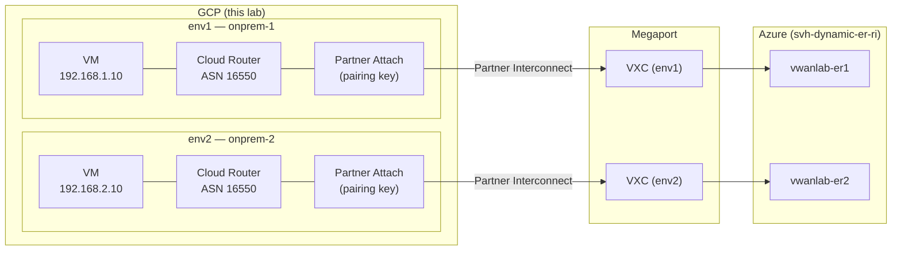

# gcp-onprem — GCP Partner Interconnect Lab

> **⚠️ LAB ONLY** — This configuration is intended for learning and testing.  
> Firewall rules are permissive. Do not use in production.

## Purpose

Deploys **one or more GCP on-premises simulation environments** with [Partner Interconnect](https://cloud.google.com/network-connectivity/docs/interconnect/concepts/partner-overview), each in the GCP region you choose.  
These GCP environments act as simulated on-prem sites that connect (via **Megaport VXC**) to Azure ExpressRoute circuits provisioned in the sibling [`svh-dynamic-er-ri`](../svh-dynamic-er-ri/README.md) lab.

The number of environments is **dynamic** — deploy a single on-prem site (the default) or many. `deploy.ps1` / `deploy.sh` prompt for a count `N` and a region per environment (with a coast-grouped picker), then generate each environment using this convention:

| Item | Value for environment *N* |
|------|---------------------------|
| Network name | `onprem-<N>` |
| Subnet name | `onprem-<N>-subnet` |
| Network / subnet CIDR | `192.168.<N>.0/24` |
| VM private IP | `192.168.<N>.10` |
| Zone | `<region>-a` |
| Cloud Router ASN | `16550` (fixed by Partner Interconnect) |

**Example** — a 2-environment deployment:

| Env  | GCP Region        | Subnet           | VM IP         | Cloud Router ASN | Azure ER circuit |
|------|-------------------|------------------|---------------|------------------|------------------|
| env1 | us-central1 (IA)  | 192.168.1.0/24   | 192.168.1.10  | 16550            | vwanlab-er1      |
| env2 | us-west2 (LA)     | 192.168.2.0/24   | 192.168.2.10  | 16550            | vwanlab-er2      |

---

## Architecture

> The diagram below illustrates a 2-environment deployment; the same pattern repeats for each environment you create (`onprem-1`, `onprem-2`, …).



---

## Prerequisites

| Tool | Minimum version | Install |
|------|----------------|---------|
| `gcloud` CLI | any recent | https://cloud.google.com/sdk/docs/install |
| `terraform` | >= 1.5 | https://developer.hashicorp.com/terraform/install |
| GCP project | — | create or use existing |

**Required GCP API** — enable before running:
```bash
gcloud services enable compute.googleapis.com --project=YOUR_PROJECT
```

Megaport account required for the cross-connect step (manual — see [`docs/megaport-cross-connect.md`](docs/megaport-cross-connect.md)).

---

## How to deploy

### Bash (Linux / macOS / WSL)

```bash
cd gcp-onprem/scripts
chmod +x deploy.sh validate.sh cleanup.sh
./deploy.sh                                         # interactive (prompts count + region per env)
./deploy.sh -p my-project -n 1 -r us-central1 -y    # single env, non-interactive
./deploy.sh -p my-project -n 3 -r us-central1 -r us-west2 -r us-east4 -y   # three envs
```

### PowerShell (Windows / cross-platform)

```powershell
cd gcp-onprem\scripts
.\deploy.ps1                                        # interactive (prompts count + region per env)
.\deploy.ps1 -Project my-project -Count 1 -Regions us-central1 -Yes
.\deploy.ps1 -Project my-project -Count 3 -Regions us-central1,us-west2,us-east4 -Yes
```

### Manual Terraform

```bash
cd gcp-onprem/terraform
cp terraform.tfvars.example terraform.tfvars
# Edit terraform.tfvars — set project = "YOUR_PROJECT_ID"
terraform init
terraform plan
terraform apply
```

---

## Parameters

| Variable | Default | Description |
|----------|---------|-------------|
| `project` | *(required)* | GCP project ID |
| `default_region` | `us-central1` | Provider default region |
| `environments` | see tfvars.example | Map of env configs (region, zone, CIDR, …) — **add or remove keys to deploy fewer or more on-prem sites**. Cloud Router ASN is fixed at 16550 by the module. |
| `allowed_source_ranges` | RFC-1918 + IAP | Firewall source CIDRs. **Must include `35.235.240.0/20`** (IAP). |

---

## Address / ASN plan

The address plan is generated per environment index *N* (`192.168.<N>.0/24`). Example showing a 2-environment deployment:

| Env  | Network/Subnet   | VM IP         | Region      | Zone         | Cloud Router ASN | Google peer ASN | Azure ER circuit |
|------|------------------|---------------|-------------|--------------|------------------|-----------------|------------------|
| env1 | 192.168.1.0/24   | 192.168.1.10  | us-central1 | us-central1-a | 16550           | 16550           | vwanlab-er1      |
| env2 | 192.168.2.0/24   | 192.168.2.10  | us-west2    | us-west2-a    | 16550           | 16550           | vwanlab-er2      |

> **Note**: For Partner Interconnect, the Cloud Router local ASN must be `16550` (Google-assigned) — custom ASNs are rejected. The Google peer ASN is also `16550` and is fixed; you cannot change either.

---

## VM access (IAP — no public IP)

VMs have **no public IP**. Use Cloud IAP for SSH (VM name is `onprem-<N>-vm`):

```bash
gcloud compute ssh onprem-1-vm --tunnel-through-iap --project=YOUR_PROJECT --zone=us-central1-a
gcloud compute ssh onprem-2-vm --tunnel-through-iap --project=YOUR_PROJECT --zone=us-west2-a
```

The firewall rule allows `35.235.240.0/20` (IAP range). Do not remove this range from `allowed_source_ranges`.

---

## Validation

After deploying:

```bash
cd gcp-onprem/scripts
./validate.sh -p YOUR_PROJECT      # bash
.\validate.ps1 -Project YOUR_PROJECT  # powershell
```

See [`docs/validation.md`](docs/validation.md) for manual gcloud checks.

---

## Megaport cross-connect (manual)

After `terraform apply`, retrieve pairing keys:

```bash
cd gcp-onprem/terraform
terraform output -json pairing_keys
```

Then follow [`docs/megaport-cross-connect.md`](docs/megaport-cross-connect.md) to create the VXCs.

---

## Cleanup

```bash
./cleanup.sh           # bash (prompts for confirm)
.\cleanup.ps1          # powershell
```

> **⚠️ Cost warning**: VLAN attachments bill hourly. Delete Megaport VXCs manually first (they are not managed by Terraform).  
> See [`docs/cost-control.md`](docs/cost-control.md).

---

## Files

```
gcp-onprem/
  terraform/
    versions.tf                  # terraform >=1.5, google ~>7.0
    providers.tf                 # google provider
    variables.tf                 # root variables
    main.tf                      # for_each module calls
    outputs.tf                   # per-env outputs
    backend.tf                   # local (GCS commented out)
    terraform.tfvars.example     # copy to terraform.tfvars
    modules/gcp-onprem/          # reusable module
      main.tf  variables.tf  outputs.tf
  scripts/
    deploy.ps1 / deploy.sh       # init + plan + apply + print keys
    validate.ps1 / validate.sh   # gcloud-based checks
    cleanup.ps1 / cleanup.sh     # terraform destroy
  docs/
    README.md                    # this file
    architecture.md              # design details
    megaport-cross-connect.md    # Megaport step-by-step
    validation.md                # manual gcloud validation commands
    cost-control.md              # cost breakdown + tips
```
