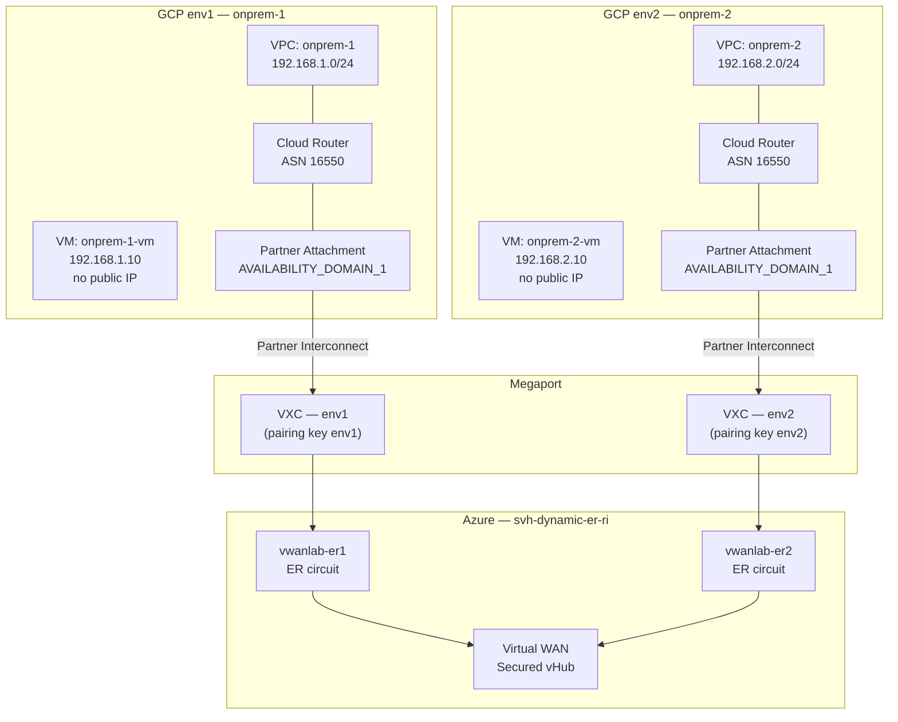

# Architecture — gcp-onprem Lab

## Overview

This lab creates **one or more** independent GCP "on-premises" simulation environments, each connected to Azure ExpressRoute via Megaport Partner Interconnect. The environment count is dynamic — define it via the `environments` map in `terraform.tfvars` (the deploy scripts prompt for a count `N` and a region per environment).

---

## Address / ASN Plan

Each environment *N* is generated as `onprem-<N>` with CIDR `192.168.<N>.0/24` and VM IP `192.168.<N>.10`. Example showing a 2-environment deployment:

| Env  | Network/Subnet   | VM IP         | Region      | Zone          | Cloud Router ASN | Google Peer ASN | Azure ER circuit |
|------|------------------|---------------|-------------|---------------|------------------|-----------------|------------------|
| env1 | 192.168.1.0/24   | 192.168.1.10  | us-central1 | us-central1-a | 16550            | 16550           | vwanlab-er1      |
| env2 | 192.168.2.0/24   | 192.168.2.10  | us-west2    | us-west2-a    | 16550            | 16550           | vwanlab-er2      |

### Cloud Router ASN — must be 16550 for Partner Interconnect

For **Partner Interconnect**, the Cloud Router that backs the attachment **must** use the Google-assigned local ASN **16550**. Custom ASNs (e.g. `65100`/`65200`) are rejected by the API with `"must be assigned a local ASN of '16550'"`. The ASN is therefore fixed in the module and is not configurable.

### Google peer ASN — 16550

For **Partner Interconnect**, Google assigns a fixed peer ASN of **16550** to the Google side of the BGP session.  
This is a Google-owned ASN and cannot be changed. When configuring the Megaport VXC or reviewing BGP sessions, expect to see ASN 16550 as the remote peer.

---

## Partner Interconnect Design



### Flow of BGP session establishment

1. **Terraform apply** creates the Partner Interconnect attachment → GCP assigns a `pairing_key`.
2. The attachment enters state `PENDING_PARTNER` — waiting for the partner (Megaport) to activate.
3. **Megaport VXC** is created with the pairing key → physical cross-connect provisioned in the colocation.
4. Attachment state → `PENDING_CUSTOMER` or `ACTIVE` after Megaport activates.
5. **BGP session** forms between the Cloud Router (local ASN 16550) and Google's router (ASN 16550).
6. Azure side: the ER connection to the Virtual WAN hub is already in place (from the sibling lab).
7. Routes exchange end-to-end across GCP ↔ Megaport ↔ Azure.

---

## IAP Access — no public IP

VMs are deployed without a public IP (`access_config {}` block removed). SSH access is provided by [Cloud Identity-Aware Proxy (IAP)](https://cloud.google.com/iap/docs/using-tcp-forwarding):

```bash
gcloud compute ssh INSTANCE_NAME --tunnel-through-iap --project=PROJECT --zone=ZONE
```

**How IAP TCP forwarding works:**
1. gcloud opens a WebSocket tunnel to `tunnel.cloudproxy.app` via HTTPS.
2. The tunnel terminates inside the VM's VPC, bypassing the need for a public IP.
3. The firewall rule allows TCP/22 from `35.235.240.0/20` (Google's IAP IP range) to tagged VMs.

> **Important**: Do not remove `35.235.240.0/20` from `allowed_source_ranges`. Removing it breaks IAP access.

---

## Firewall Design

A single VPC-level firewall rule per environment allows TCP, UDP, and ICMP from:

| CIDR             | Purpose                      |
|-----------------|------------------------------|
| 10.0.0.0/8       | Azure RFC-1918 space          |
| 172.16.0.0/12    | Azure RFC-1918 space          |
| 192.168.0.0/16   | Lab RFC-1918 space            |
| 35.235.240.0/20  | GCP IAP TCP forwarding range  |

The firewall rule uses `target_tags` (`onprem-<N>-vm`, e.g. `onprem-1-vm`) so it applies only to tagged VMs, not all instances in the VPC.

---

## Module structure

```
modules/gcp-onprem/
  main.tf        # VPC, subnet, firewall, VM, Cloud Router, Interconnect attachment
  variables.tf   # project, region, zone, gcp_onprem (object), allowed_source_ranges
  outputs.tf     # network_self_link, subnet_name, router_name, attachment_name,
                 # pairing_key (sensitive), vm_private_ip
```

The root `main.tf` instantiates this module once per entry in `var.environments` using `for_each`.
