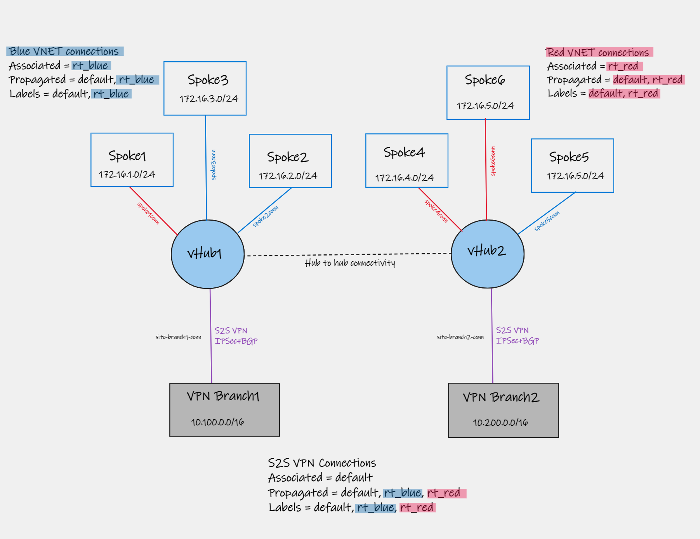

# Lab - Virtual WAN with Isolated VNETs using custom route tables

## Intro

The goal of this lab is to demonstrate and validate Azure Virtual WAN using Isolated VNETs by leveraging a similar scenario to the one published by the vWAN official document [Scenario: Custom isolation for VNets](https://docs.microsoft.com/en-us/azure/virtual-wan/scenario-isolate-vnets-custom).

### Lab Diagram

The lab uses the same amount of VNETs (six total) and two regions with Hubs, and remote connectivity to two branches using site-to-site VPN using and BGP. Below is a diagram of what you should expect to get deployed:



### Prerequisites

Run commands below over Linux VM with Azure CLI or [Azure Cloud Shell using Bash](https://shell.azure.com).
Note that the variables used do not work over Azure CLI inside PowerShell.

### Deploy this solution

The lab is also available in the above .azcli that you can rename as .sh (shell script) and execute. You can open [Azure Cloud Shell (Bash)](https://shell.azure.com).

Review the parameters below and make changes based on your needs:

```Bash
# Parameters (make changes based on your requirements)
loc1=eastus
loc2=westus
rg=lab-vwan-rb
vwanname=vwan-rb
hub1name=hub1
hub2name=hub2
username=azureuser
password="Msft123Msft123" #Please change your password
vmsize=Standard_DS1_v2 #VM Size
mypip=$(curl -4 ifconfig.io -s) #Replace with your home Public IP in case you run this over Cloudshell
```

Please, run the following steps to build the entire lab:

```bash
wget -O ivc-deploy.sh https://raw.githubusercontent.com/dmauser/azure-virtualwan/main/isolate-vnets-custom/ivc-deploy.azcli
chmod +xr ivc-deploy.sh
./ivc-deploy.sh
```

### Validate
```bash
# Parameters 
rg=lab-vwan-rb #set resource group

#### Validate connectivity between VNETs and Branches

# 1) Dump VMs route tables:
for nicname in `az network nic list -g $rg --query [].name -o tsv`
do 
echo -e $nicname effective routes:
az network nic show-effective-route-table -g $rg --name $nicname --output table
echo -e 
done

# 2) Test connectivity between VMs (they can be accessible via SSH over Public IP or Serial Console)
# 3) Dump all vHUBs route tables.
for vhubname in `az network vhub list -g $rg --query "[].id" -o tsv | rev | cut -d'/' -f1 | rev`
do
  for routetable in `az network vhub route-table list --vhub-name $vhubname -g $rg --query "[].id" -o tsv`
   do
   if [ "$(echo $routetable | rev | cut -d'/' -f1 | rev)" != "noneRouteTable" ]; then
     echo -e vHUB: $vhubname 
     echo -e Effective route table: $(echo $routetable | rev | cut -d'/' -f1 | rev)   
     az network vhub get-effective-routes -g $rg -n $vhubname \
     --resource-type RouteTable \
     --resource-id $routetable \
     --query "value[].{addressPrefixes:addressPrefixes[0], asPath:asPath, nextHopType:nextHopType}" \
     --output table
     echo
    fi
   done
done

```

### Clean-up

```bash
# Parameters 
rg=lab-vwan-rb #set resource group

### Clean up
az group delete -g $rg --no-wait 
```