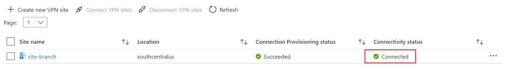
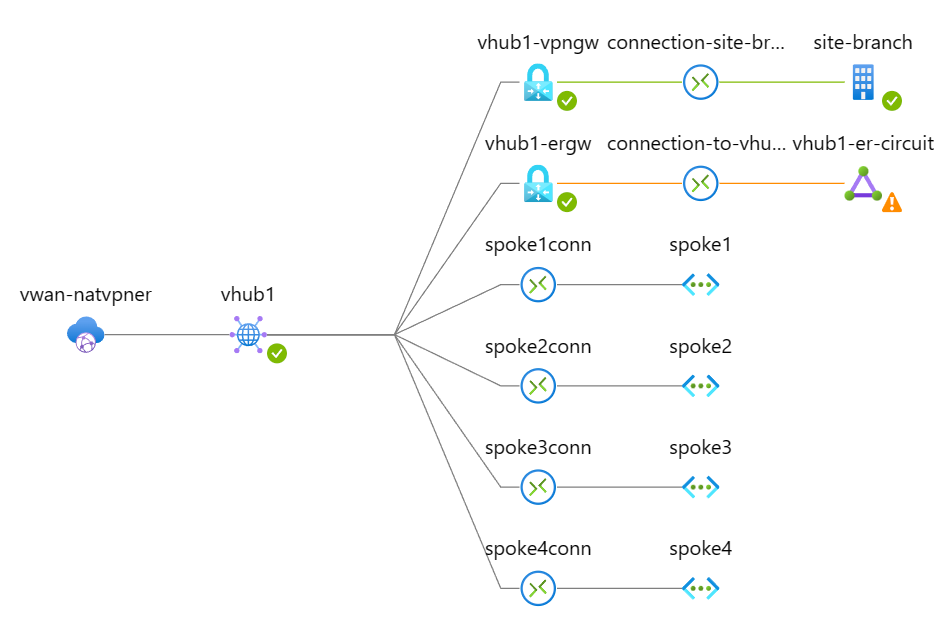
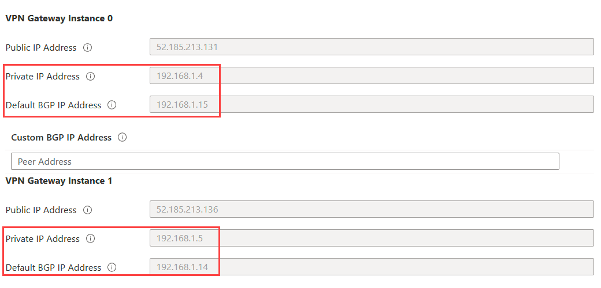
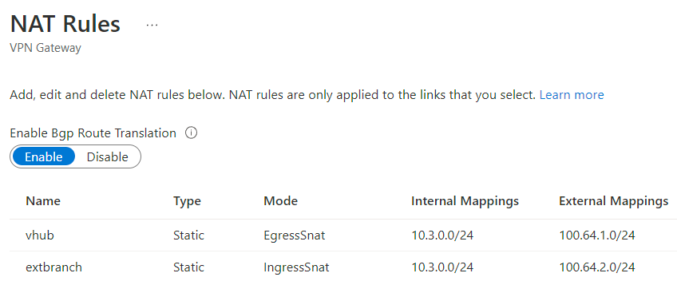
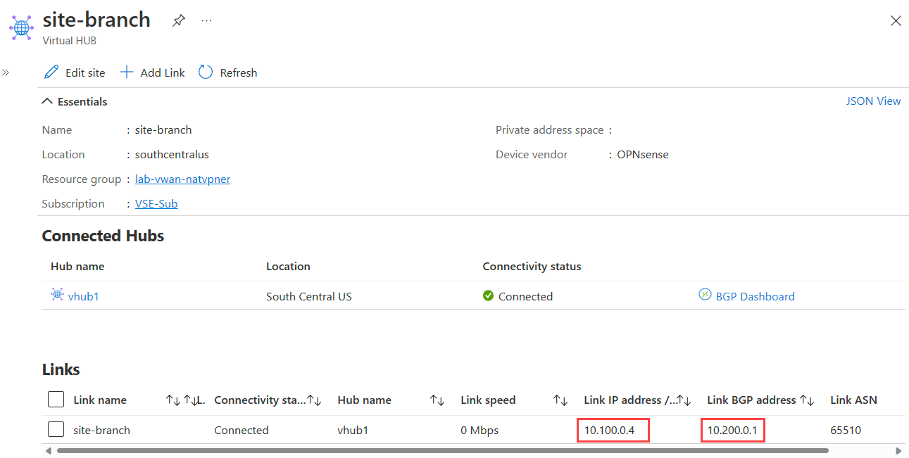
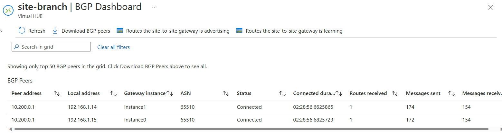
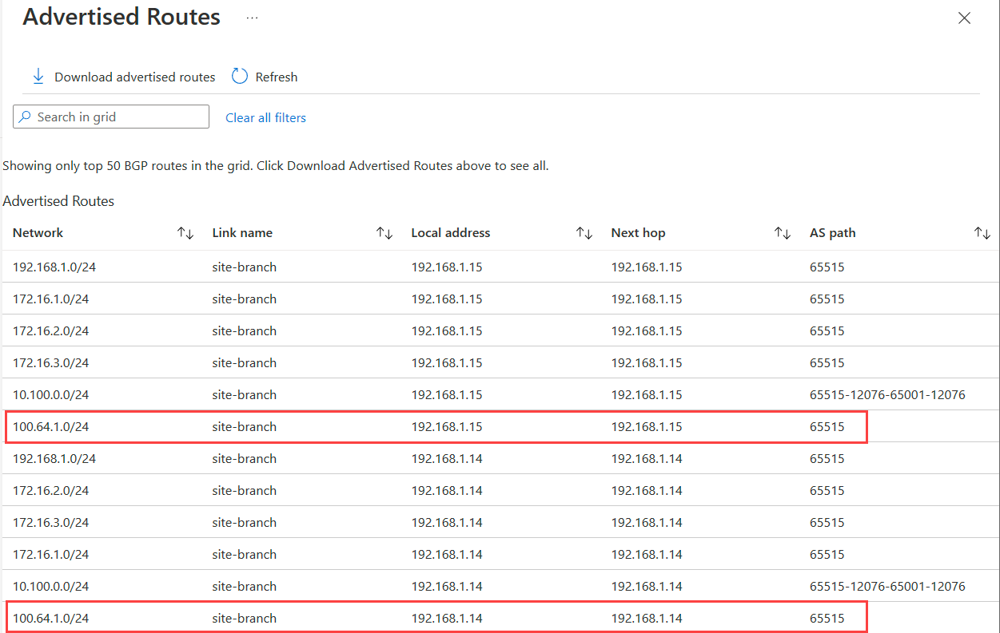
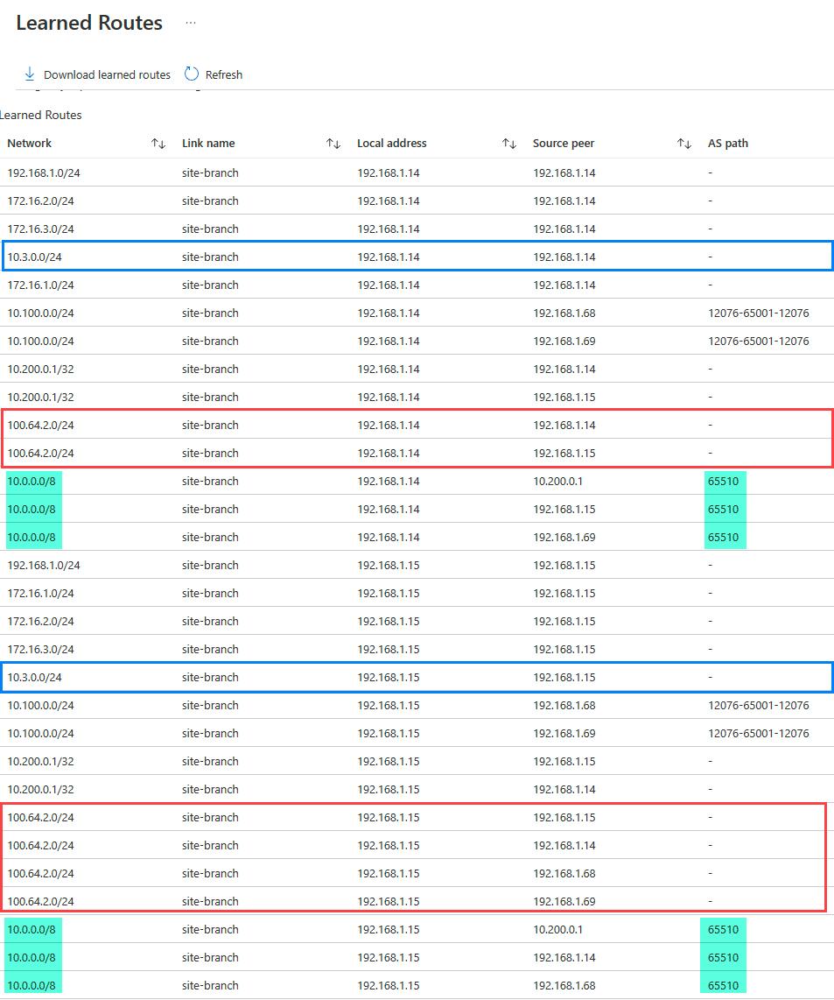
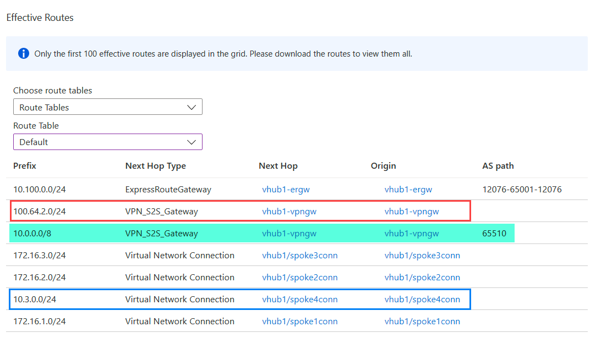
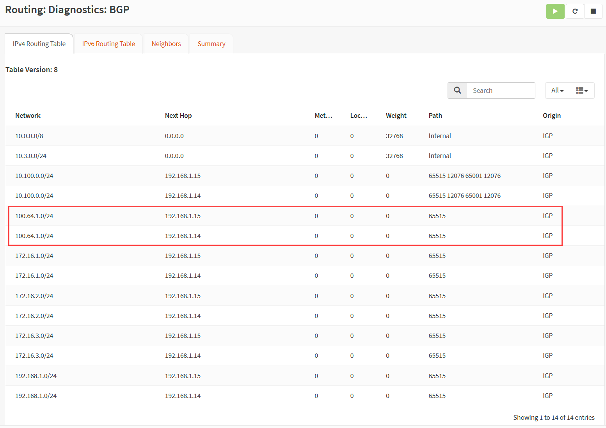

# Lab - Virtual WAN Scenario: IPsec VPN with NAT over ER

In this article

- [Intro](#intro)
- [Lab Diagram](#lab-diagram)
- [Considerations and requirements](#considerations-and-requirements)
- [Deploy this solution](#deploy-this-solution)
  - [Step 1 - Deploy the Lab](#step-1---deploy-the-lab)
  - [Step 2 - Provision ER Circuits with the Provider](#step-2---provision-er-circuits-with-the-provider)
  - [Step 3 - Connect ER Circuits to respective ER Gateway](#step-3---connect-er-circuits-to-respective-er-gateway)
- [Validation](#validation)
  - [Azure Virtual WAN](#azure-virtual-wan)
    - [Topology](#topology)
    - [VPN Gateway configuration](#vpn-gateway-configuration)
    - [VPN Gateway NAT rules](#vpn-gateway-nat-rules)
    - [VPN Site connection](#vpn-site-connection)
    - [VPN Gateway BGP Dashboard](#vpn-gateway-bgp-dashboard)
    - [vHub Effective Routes](#vhub-effective-routes)
  - [OPNsense](#opnsense)
    - [BGP configuration](#bgp-configuration)
    - [BGP route table](#bgp-route-table)
  - [Connectivity](#connectivity)
    - [Summary](#summary)
    - [Effective Route Table](#effective-route-table)
    - [Connectivity Test](#connectivity-validation)
    - [How to know if traffic goes over ER only or IPSec VPN over ER?](#how-to-know-if-traffic-goes-over-er-only-or-ipsec-vpn-over-er)

## Intro

The goal of this lab is to validate IPSec over ExpressRoute using Virtual WAN to address overlapping IP prefixes by leveraging vWAN VPN Gateway NAT feature.
You may be familiar with the official vWAN documentation on this subject. However, the scenario covered over the official documentation is two remote branches with the same overlapping IP, for more information consult: [Configure NAT rules for your Virtual WAN VPN gateway](https://learn.microsoft.com/en-us/azure/virtual-wan/nat-rules-vpn-gateway). The intention here is to address scenarios where there are Azure and On-premises with overlapping IP prefixes.

For the scenario covered in this lab, two networks are using the same IP prefix (10.3.0.0/24), one on-premises (extended branch) and another in Azure VNET (Spoke4) connected to Virtual WAN.
That is to demonstrate that you can use IPSec + NAT VPN Gateway functionality to handle overlapping IP scenarios usually common on Vendor integration or merging and acquisitions.
Another important point to highlight for the context of this lab is the overlapping traffic goes over IPSec VPN the other non-overlapping traffic goes over regular ExpressRoute.

## Lab Diagram


On the diagram above, the extended branch, VM (10.3.0.4) always goes over IPSec over ExpressRoute when communicating with any Spoke Azure VM. It will always show it with source IP 100.64.2.4.
Azure VM on the spoke 4 (10.3.0.4) will reach the extended branch VM using 100.64.2.4 but it will show its source IP as 100.64.1.4.

## Considerations and requirements

- An Extended-Branch with prefix range 10.3.0.0/24 overlaps with Spoke4 VNET connected to the vHUB.
 - 100.64.1.0/24 is the NAT address prefix associated with the Spoke4 VNET.
 - 100.64.2.0/24 is the NAT address prefix associated with the extended branch.
- Traffic between Extended-Branch and all vWAN-connected spokes (1,2,3 and 4) will always go over IPSec over ER and get translated to 100.64.2.0/24 (as source) when hits any of those VNETS. On the other way, vWAN-connected spokes will reach Extended-Branch using IPSec over ER but only Spoke4 VNET gets translated to 100.64.2.0/24. The remaining spoke VNETs 1,2 and 3 will retain their address space (see connectivity tests output for more information)
- The Branch (10.100.0.0/24) has an NVA OPNSense preconfigured with S2S VPN reaching both vWAN VPN Gateway instances using private IPs 192.168.1.4 and 192.168.1.5.
  - Note that **OPNsense** used as VPN Server has **username:root** and **password:opnsense** and its accessible via HTTPS over its public IP associated with the untrusted NIC.
  - A BGP session is configured between the VTI interfaces (10.200.0.1) and both vWAN VPN Gateway instances BGP IPs 192.168.1.14 and 192.168.1.15.  **Note** that VPN GW BGP IPs may be different during your provisioning. There are cases that those IPs can be set to 192.168.1.12 and 192.168.1.13.
  - OPNSense advertises 10.3.0.0/24 and 10.0.0.0/8 and has ASN set to 65510.
  - You have to advertise the 10.3.0.0/24 (overlapping with Azure) in order to vWAN VPN Gateway NAT rule to translate it to 100.64.2.0/24.
  - :point_right: **Special note:** BGP over APIPA does not work over NAT, you have to use default BGP IP addresses vWAN VPN Gateway .14 and .15
 - This lab creates two Expressroute circuits and requires you to provision them with an ER connectivity provider. In this particular lab, I used MegaPort Cloud Router (MCR) to connect both ER circuits.
 - All VMs are Linux Ubuntu accessible via SSH restricted by your Public IP (see $mypip parameter) or using Serial Console.

## Deploy this solution

The lab is also available in the above .azcli that you can rename as .sh (shell script) and execute. You can open [Azure Cloud Shell (Bash)](https://shell.azure.com).

Review the parameters below and make changes based on your needs:

```Bash
#Parameters
region=southcentralus
rg=lab-vwan-vpner
vwanname=vwan-vpner
hubname=vhub1
username=azureuser
password="Msft123Msft123" #Please change your password
vmsize=Standard_DS1_v2 #VM Size
mypip=$(curl -4 ifconfig.io -s) #Replace with your home Public IP in case you run this over Cloudshell
```

Please, run the following steps to build the entire lab:

### Step 1 - Deploy the Lab

```bash
wget -O vwan-natvpner-deploy.sh https://raw.githubusercontent.com/dmauser/azure-virtualwan/main/natvpn-over-er/natvpner-deploy.azcli
chmod +xr vwan-natvpner-deploy.sh
./vwan-natvpner-deploy.sh
```

### Step 2 - Provision ER Circuits with the Provider

Ensure that ExpressRoute Circuits er-circuit-vhub1 and er-circuit-branch are provisioned. That is required to connect them to the respective ER Gateways in Step 3.

### Step 3 - Connect ER Circuits to respective ER Gateway

In this step, the script below connects branch-er-circuit to the Branch ER Gateway and vhub1-er-circuit to the vHub ER Gateway.

```bash
wget -O vwan-natvpner-conn.sh https://raw.githubusercontent.com/dmauser/azure-virtualwan/main/vpn-over-er/natvpner-conn.azcli
chmod +xr vwan-natvpner-conn.sh
./vwan-natvpner-conn.sh
```

After 3-5 minutes that you complete the step, the Site-Branch VPN connection should show up and running on the Azure vWAN Portal under vHub1 VPN (Site-to-Site) as shown:



## Validation

In the below sections, we have a breakdown of the vWAN configuration highlighting some important points of this solution.

### Azure Virtual WAN

#### Topology

Via the networking insights, we can get a good view of the vWAN topology and its components.




#### VPN Gateway configuration

VPN Gateways, a special highlight for the Private IP addresses and the default BGP IP Address. For NAT you must use Default BGP IP addresses. It does not work with Custom BGP IP addresses listed below as APIPA.



#### VPN Gateway NAT rules

There are two NAT rules:

1. **Vhub** EgressSnat static NAT rule that applies to all traffic going towards on-premises extended branch 10.3.0.0/24 which will get translated to 100.64.1.0/24.
2. **Extbranch** IngressSnat static NAT rule that applies to all traffic from on-premises extended branch 10.3.0.0/24 which will get translated to 100.64.2.0/24.



#### VPN Site connection

This screen shows the VPN Site with the connection reaching over OPNsense private IP 10.100.0.4 where the IPSec tunnel is terminated and BGP private IP 10.200.0.1 is associated with the IPSec interface.



#### VPN Gateway BGP Dashboard

1. BGP peer status

There are two BGP sessions over IPSec with the remote OPNSense BGP IP 10.200.0.1 as shown:



2. VPN Gateway advertised routes

The connected Spoke4 VNET which has 10.3.0.0/24 will be advertised as 100.64.1.0/24 as shown:



3. VPN Gateway learned routes

- 10.3.0.0/24 is a local route entry that represents the Spoke4 VNET.
- 100.64.2.0/24 represents NAT for the extended branch 10.3.0.0/24. You will see multiple times this entry because there's a BGP peer between both VPN Gateway instances (192.168.1.14 and 192.168.1.15), vHUB Virtual Router instances (192.168.1.68 and 192.168.1.69). Also, the source peer is the VPN Gateway instances themselves. That is expected because VPN Gateway is responsible for the translation based on the extbranch IngressSnat rule observed on the NAT rules above.
- 10.0.0.0/8 is a summary advertised by the on-premises OPNsense via BGP with AS path 65510.



#### vHub Effective Routes

1. **100.64.2.0/24** is the extended branch 10.3.0.0/24 translated prefix.
2. OPNSense also advertises **10.0.0.0/8** prefix via BGP and you can see the AS path 65510.
3. The Spoke4 VNET **10.3.0.0/24** has a VNET connection entry as expected.



### OPNSense 

#### BGP configuration

- Below we have the full dump of the OPNsense BGP configuration:

```Text
Building configuration...

Current configuration:
!
frr version 7.5.1
frr defaults traditional
hostname OPNsense.localhost
log syslog notifications
!
router bgp 65510
 no bgp ebgp-requires-policy
 no bgp default ipv4-unicast
 neighbor 192.168.1.14 remote-as 65515
 neighbor 192.168.1.14 ebgp-multihop 255
 neighbor 192.168.1.15 remote-as 65515
 neighbor 192.168.1.15 ebgp-multihop 255
 !
 address-family ipv4 unicast
  network 10.0.0.0/8
  network 10.3.0.0/24
  neighbor 192.168.1.14 activate
  neighbor 192.168.1.15 activate
 exit-address-family
!
line vty
!
end
```

#### BGP route table

In the screenshot below you can see Spoke 4 original prefix 10.3.0.0/24 comes as 100.64.1.0/24 translated by BGP on the Azure VPN Gateway side based on the [NAT rule configuration](#vhub-vpn-gateway-nat-rules).



### Connectivity

#### Summary

| Source | Destination | Path | What destination sees as source IP |
|------|------|------|------|
| ExtBranchVM (10.3.0.4/100.64.2.4) | Spoke4VM (10.3.0.4/100.64.1.4) | IPSec over ER |  100.64.2.4
| ExtBranchVM (10.3.0.4/100.64.2.4) | Spoke1VM (172.16.1.4)  | IPSec over ER | 100.64.2.4
| ExtBranchVM (10.3.0.4/100.64.2.4) | Spoke2VM (172.16.2.4)  | IPSec over ER | 100.64.2.4
| ExtBranchVM (10.3.0.4/100.64.2.4) | Spoke3VM (172.16.2.4)  | IPSec over ER | 100.64.2.4
| BranchVM (10.100.0.100) | Spoke1VM (172.16.1.4)  | ER | 10.100.0.100
| BranchVM (10.100.0.100) | Spoke2VM (172.16.2.4)  | ER | 10.100.0.100
| BranchVM (10.100.0.100) | Spoke3VM (172.16.3.4)  | ER | 10.100.0.100
| BranchVM (10.100.0.100) | Spoke4VM(10.3.0.4/100.64.1.4 NAT)   | Unreachable/NA only reachable over IPSec (See 1)

(1) - You can propagate 10.100.0.0/24 over VPN and BranchVM will be able to reach Spoke4VM using IPSec over ER.


#### Effective route table

Below you can see the effective routes for Spoke1VM and Extended-Branch.

**Spoke1VM effective routes:**
See comments on each prefix destination.

```Bash

Source                 State    Address Prefix    Next Hop Type          Next Hop IP
---------------------  -------  ----------------  ---------------------  -------------
Default                Active   172.16.1.0/24     VnetLocal
Default                Active   192.168.1.0/24    VNetPeering
VirtualNetworkGateway  Active   172.16.2.0/24     VirtualNetworkGateway  40.74.161.110 => vHub Virtual Router (Spoke2 VNET prefix)
VirtualNetworkGateway  Active   10.100.0.0/24     VirtualNetworkGateway  10.20.78.139 => ExpressRoute MSEE (Branch Prefix)
VirtualNetworkGateway  Active   100.64.2.0/24     VirtualNetworkGateway  192.168.1.15 => vHub VPN Gateway (Extended Branch Prefix)
VirtualNetworkGateway  Active   100.64.2.0/24     VirtualNetworkGateway  192.168.1.14 => vHub VPN Gateway (Extended Branch Prefix)
VirtualNetworkGateway  Active   10.3.0.0/24       VirtualNetworkGateway  40.74.161.110 => vHub Virtual Router (Spoke4 VNET prefix)
VirtualNetworkGateway  Active   172.16.3.0/24     VirtualNetworkGateway  40.74.161.110 => vHub Virtual Router (Spoke3 VNET prefix)
VirtualNetworkGateway  Active   10.0.0.0/8        VirtualNetworkGateway  192.168.1.15 => vHub VPN Gateway (10/8 prefix advertised by OPNSense)
VirtualNetworkGateway  Active   10.0.0.0/8        VirtualNetworkGateway  192.168.1.14 => vHub VPN Gateway (10/8 prefix advertised by OPNSense)
Default                Active   0.0.0.0/0         Internet
```

**Extend-branch VM effective routes:**

```Bash
extbranch1VMVMNic effective routes:
Source    State    Address Prefix    Next Hop Type     Next Hop IP
--------  -------  ----------------  ----------------  -------------
Default   Active   10.3.0.0/24       VnetLocal
Default   Active   10.100.0.0/24     VNetPeering
Default   Invalid  0.0.0.0/0         Internet
User      Active   0.0.0.0/0         VirtualAppliance  10.100.0.20 => UDR to force all traffic to the OPNsense trusted interface
```

#### Connectivity validation

From Extended Branch VM (10.3.0.4) to Azure Spoke1 VM (172.16.1.4) and Spoke4 VM (100.64.1.4).

```Bash
azureuser@extbranch1VM:~$ hostname -I
10.3.0.4 
azureuser@extbranch1VM:~$ ping 172.16.1.4 -c 5
PING 172.16.1.4 (172.16.1.4) 56(84) bytes of data.
64 bytes from 172.16.1.4: icmp_seq=1 ttl=63 time=20.5 ms
64 bytes from 172.16.1.4: icmp_seq=2 ttl=63 time=22.8 ms
64 bytes from 172.16.1.4: icmp_seq=3 ttl=63 time=21.1 ms
64 bytes from 172.16.1.4: icmp_seq=4 ttl=63 time=20.6 ms
64 bytes from 172.16.1.4: icmp_seq=5 ttl=63 time=20.7 ms

--- 172.16.1.4 ping statistics ---
5 packets transmitted, 5 received, 0% packet loss, time 4006ms
rtt min/avg/max/mdev = 20.558/21.190/22.808/0.852 ms
azureuser@extbranch1VM:~$ ping 100.64.1.4 -c 5
PING 100.64.1.4 (100.64.1.4) 56(84) bytes of data.
64 bytes from 100.64.1.4: icmp_seq=1 ttl=63 time=21.2 ms
64 bytes from 100.64.1.4: icmp_seq=2 ttl=63 time=19.5 ms
64 bytes from 100.64.1.4: icmp_seq=3 ttl=63 time=18.8 ms
64 bytes from 100.64.1.4: icmp_seq=4 ttl=63 time=19.4 ms
64 bytes from 100.64.1.4: icmp_seq=5 ttl=63 time=20.6 ms

--- 100.64.1.4 ping statistics ---
5 packets transmitted, 5 received, 0% packet loss, time 4006ms
rtt min/avg/max/mdev = 18.895/19.933/21.234/0.870 ms
```

Below is what Spoke1 VMs receives based on the tcpdump capture. You can see extended branch VM arrives with IP **100.64.2.4** because of the NAT rule processed by vWAN VPN Gateway.

```Bash
azureuser@spoke1VM:~$ hostname -I
172.16.1.4 
azureuser@spoke1VM:~$ sudo tcpdump -n icmp
tcpdump: verbose output suppressed, use -v or -vv for full protocol decode
listening on eth0, link-type EN10MB (Ethernet), capture size 262144 bytes
18:23:51.020464 IP 100.64.2.4 > 172.16.1.4: ICMP echo request, id 4904, seq 1, length 64
18:23:51.020507 IP 172.16.1.4 > 100.64.2.4: ICMP echo reply, id 4904, seq 1, length 64
18:23:52.020856 IP 100.64.2.4 > 172.16.1.4: ICMP echo request, id 4904, seq 2, length 64
18:23:52.020899 IP 172.16.1.4 > 100.64.2.4: ICMP echo reply, id 4904, seq 2, length 64
18:23:53.020526 IP 100.64.2.4 > 172.16.1.4: ICMP echo request, id 4904, seq 3, length 64
18:23:53.020568 IP 172.16.1.4 > 100.64.2.4: ICMP echo reply, id 4904, seq 3, length 64
18:23:54.020006 IP 100.64.2.4 > 172.16.1.4: ICMP echo request, id 4904, seq 4, length 64
18:23:54.020069 IP 172.16.1.4 > 100.64.2.4: ICMP echo reply, id 4904, seq 4, length 64
18:23:55.019763 IP 100.64.2.4 > 172.16.1.4: ICMP echo request, id 4904, seq 5, length 64
18:23:55.019824 IP 172.16.1.4 > 100.64.2.4: ICMP echo reply, id 4904, seq 5, length 64
```

In the same way, here is what Spoke4VM (10.3.0.4/100.64.1.4) receives from extended branch VM (10.3.0.4/100.64.2.4).

```Bash
azureuser@spoke4VM:~$ hostname -I
10.3.0.4 
azureuser@spoke4VM:~$ sudo tcpdump -n icmp
tcpdump: verbose output suppressed, use -v or -vv for full protocol decode
listening on eth0, link-type EN10MB (Ethernet), capture size 262144 bytes
02:28:52.825625 IP 100.64.2.4 > 10.3.0.4: ICMP echo request, id 9076, seq 1, length 64
02:28:52.825691 IP 10.3.0.4 > 100.64.2.4: ICMP echo reply, id 9076, seq 1, length 64
02:28:53.826594 IP 100.64.2.4 > 10.3.0.4: ICMP echo request, id 9076, seq 2, length 64
02:28:53.826652 IP 10.3.0.4 > 100.64.2.4: ICMP echo reply, id 9076, seq 2, length 64
02:28:54.827154 IP 100.64.2.4 > 10.3.0.4: ICMP echo request, id 9076, seq 3, length 64
02:28:54.827196 IP 10.3.0.4 > 100.64.2.4: ICMP echo reply, id 9076, seq 3, length 64
02:28:55.830203 IP 100.64.2.4 > 10.3.0.4: ICMP echo request, id 9076, seq 4, length 64
02:28:55.830244 IP 10.3.0.4 > 100.64.2.4: ICMP echo reply, id 9076, seq 4, length 64
02:28:56.831013 IP 100.64.2.4 > 10.3.0.4: ICMP echo request, id 9076, seq 5, length 64
02:28:56.831047 IP 10.3.0.4 > 100.64.2.4: ICMP echo reply, id 9076, seq 5, length 64
```

##### How to know if traffic goes over ER only or IPSec VPN over ER?

There are complex or simpler ways to determine where the traffic between on-premises and Azure goes. The complex way is to take multiple captures in the OPNsense, VPN Gateways, as well as source and target VMs. However, I will explain the simplest way which is just taking a look at the ICMP TTL using a simple ping test.

In the previous example, you see NAT is triggered only using IPsec VPN and it will show a higher **TTL** which is **63**. When traffic goes over ER it will decrement **TTL to 60** based on the number of hops that the traffic goes thru.

Here is an example when Spoke1VM reaches extended branchvm (10.3.0.4/NAT IP 100.64.2.4) and branchvm (10.100.0.100) and you will see **TTL is 60** because it goes over multiple hops (customer router, provider, ER Gateways, etc.).

```Bash
azureuser@spoke1VM:~$ hostname -I
172.16.1.4 
azureuser@spoke1VM:~$ ping 100.64.2.4 -c 5
PING 100.64.2.4 (100.64.2.4) 56(84) bytes of data.
64 bytes from 100.64.2.4: icmp_seq=1 ttl=63 time=19.6 ms
64 bytes from 100.64.2.4: icmp_seq=2 ttl=63 time=21.0 ms
64 bytes from 100.64.2.4: icmp_seq=3 ttl=63 time=21.6 ms
64 bytes from 100.64.2.4: icmp_seq=4 ttl=63 time=21.5 ms
64 bytes from 100.64.2.4: icmp_seq=5 ttl=63 time=18.6 ms

--- 100.64.2.4 ping statistics ---
5 packets transmitted, 5 received, 0% packet loss, time 4006ms
rtt min/avg/max/mdev = 18.698/20.517/21.655/1.181 ms
azureuser@spoke1VM:~$ ping 10.100.0.100 -c 5
PING 10.100.0.100 (10.100.0.100) 56(84) bytes of data.
64 bytes from 10.100.0.100: icmp_seq=1 ttl=60 time=18.4 ms
64 bytes from 10.100.0.100: icmp_seq=2 ttl=60 time=17.4 ms
64 bytes from 10.100.0.100: icmp_seq=3 ttl=60 time=17.4 ms
64 bytes from 10.100.0.100: icmp_seq=4 ttl=60 time=17.3 ms
64 bytes from 10.100.0.100: icmp_seq=5 ttl=60 time=18.7 ms

--- 10.100.0.100 ping statistics ---
5 packets transmitted, 5 received, 0% packet loss, time 4006ms
rtt min/avg/max/mdev = 17.370/17.878/18.764/0.598 ms
```
