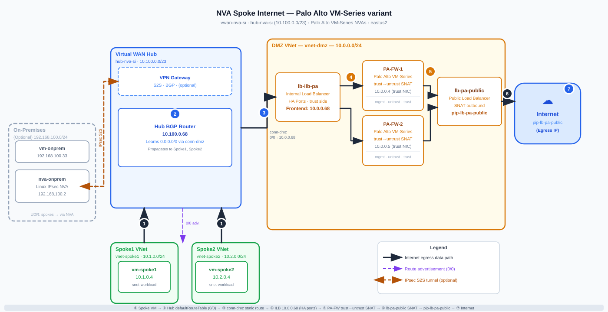

# Lab — NVA in DMZ Spoke for Internet Egress (Palo Alto VM-Series, Bicep IaC)

## Overview

This lab deploys a **Standard Azure Virtual WAN hub** (`10.100.0.0/23`) with two spoke VNets and a dedicated **DMZ VNet** that hosts an active/active pair of **Palo Alto VM-Series (vmseries-flex, BYOL)** firewalls. Each PA firewall has **3 NICs** (management, untrust, trust) and self-configures from a PAN-OS day-0 **bootstrap package** uploaded to Azure Files by the deploy script. The trust NICs sit behind a **Standard Internal Load Balancer** (HA-port mode, frontend `10.0.0.68`); the untrust NICs sit behind a **Standard Public Load Balancer** for outbound SNAT. A static default route (`0.0.0.0/0`) on the hub's DMZ connection points to the ILB frontend, so all traffic leaving Spoke1 and Spoke2 egresses to the internet through the PA firewalls via SNAT on the Public LB. An **optional on-premises block** — a Linux VM plus a strongSwan/FRR NVA running BGP-over-IPsec — can be deployed at prompt time; it terminates a site-to-site VPN into a vHub VPN Gateway and learns Spoke1/Spoke2 routes via BGP. The entire lab is **Bicep IaC** with interactive Bash and PowerShell wrappers that handle marketplace image terms acceptance, bootstrap storage creation, hub polling, and post-deploy routing steps that Bicep cannot safely sequence.

This lab is a **Palo Alto VM-Series variant** of the Linux IPTables lab at [`nva-spoke-internet/`](../nva-spoke-internet/README.md). The two labs share identical vWAN topology, hub routing logic, ILB frontend IP, and on-prem connectivity model. The only difference is the NVA layer: Ubuntu IPTables → Palo Alto VM-Series with PAN-OS security policy and NAT.

## Architecture



> 📐 [Open the editable diagram in Excalidraw](https://excalidraw.com/#url=https://raw.githubusercontent.com/dmauser/azure-virtualwan/main/nva-spoke-internet-paloalto/media/nva-spoke-internet-paloalto.excalidraw)

## Address Plan

| Network | CIDR | Subnets |
|---------|------|---------|
| vWAN Hub | `10.100.0.0/23` | (managed) |
| DMZ VNet | `10.0.0.0/24` | `snet-mgmt` `10.0.0.0/27` · `snet-untrust` `10.0.0.32/27` · `snet-trust` `10.0.0.64/27` |
| Spoke1 VNet | `10.1.0.0/24` | `snet-workload` `10.1.0.0/26` |
| Spoke2 VNet | `10.2.0.0/24` | `snet-workload` `10.2.0.0/26` |
| On-prem VNet _(optional)_ | `192.168.100.0/24` | `snet-nva` `192.168.100.0/27`, `snet-workload` `192.168.100.32/27` |

**Key IPs / ASNs**

| Resource | Value |
|----------|-------|
| ILB frontend (0/0 next-hop) | `10.0.0.68` (inside `snet-trust`) |
| snet-mgmt gateway | `10.0.0.1` |
| snet-untrust gateway | `10.0.0.33` |
| snet-trust gateway | `10.0.0.65` |
| Hub VPN Gateway BGP ASN | `65515` |
| On-prem NVA BGP ASN | `65001` |

**DMZ Subnet Design — why 3 subnets instead of 2**

The Linux variant uses 2 subnets (`snet-nva` + `snet-ilb`). Palo Alto VM-Series requires NIC separation between management, internet-facing, and hub-facing traffic planes:

| Subnet | CIDR | UDR | Purpose |
|--------|------|-----|---------|
| `snet-mgmt` | `10.0.0.0/27` | `0/0 → Internet` | PA management plane (HTTPS GUI, SSH, licensing) |
| `snet-untrust` | `10.0.0.32/27` | `0/0 → Internet` | PA untrust zone; Public LB backend (SNAT egress) |
| `snet-trust` | `10.0.0.64/27` | **None** | PA trust zone; ILB backend (HA-ports, `0/0 → 10.0.0.68`) |

> ⚠️ **`snet-trust` has no `0/0` UDR by design.** Adding one would black-hole the asymmetric return path (spoke → hub → PA trust NIC → UDR → Internet, skipping the spoke entirely). Return traffic from trust must exit via the vWAN-learned routes to reach spoke destinations.

## How the Default Route Works

```
Spoke1 / Spoke2 VM
   |
   |  0.0.0.0/0 learned from hub defaultRouteTable
   v
vWAN Hub  --(static route 0/0 -> 10.0.0.68)-->  DMZ VNet connection (conn-dmz)
                                                       |
                                                       v
                                         Internal LB (HA ports, VIP 10.0.0.68)
                                                  |           |
                                                  v           v
                                              PA-FW-0      PA-FW-1   (active/active)
                                              eth2 (trust)  eth2 (trust)
                                                  |           |
                                                  +-----+-----+
                                                        |
                                                        v  PAN-OS security policy (trust→untrust)
                                                        |  Source NAT → ethernet1/1 DHCP IP
                                              eth1 (untrust) on both firewalls
                                                        |
                                                        v
                                              Public Load Balancer
                                                        |
                                                        v  SNAT → pip-lb-public
                                                    Internet
```

**Route programming details:**

1. The hub `defaultRouteTable` contains a static route: `0.0.0.0/0` → next-hop type `ResourceID` → DMZ connection resource ID (`conn-dmz`).
2. The DMZ VNet connection (`conn-dmz`) has a static route: `0.0.0.0/0` → next-hop IP `10.0.0.68` (ILB frontend in `snet-trust`).
3. Both Spoke1 and Spoke2 hub connections associate and propagate to `defaultRouteTable`, so they automatically learn the `0/0`.
4. The `snet-mgmt` and `snet-untrust` subnets carry a UDR with `0.0.0.0/0 → Internet` so PA firewalls egress directly — they are not caught by their own propagated hub default route.
5. PAN-OS on each firewall applies a security policy (trust → untrust, permit all) and a source NAT rule (`dynamic-ip-and-port` using the `ethernet1/1` DHCP IP). The Public LB then re-translates this to the Public LB PIP — double-SNAT design exactly matching the Linux lab.
6. ILB health probes on TCP/22 hit the PA trust NICs (`ethernet1/2`); Public LB probes on TCP/22 hit the PA untrust NICs (`ethernet1/1`). The PA bootstrap configures management profiles that respond to these probes.

> ⚠️ **Hub routing sequencing**: Hub VNet connections and route-table programming are performed by the deploy script **after** `routingState = Provisioned`, not in Bicep. This is intentional — the Azure control plane rejects connection/route operations while the hub is still initialising.

## Palo Alto VM-Series Details

### BYOL Licensing — What Works Without a License

The VM-Series boots in **BYOL / eval mode** (approximately 30-day evaluation period). During this time:

| Feature | Unlicensed (eval) | Licensed |
|---------|------------------|----------|
| Routing (virtual router) | ✅ Full | ✅ Full |
| NAT / SNAT | ✅ Full | ✅ Full |
| Basic security policy (permit/deny) | ✅ Full | ✅ Full |
| App-ID application identification | ✅ Full | ✅ Full |
| Threat Prevention (IPS, AV, WF) | ❌ Not active | ✅ With TP license |
| URL Filtering | ❌ Not active | ✅ With URL license |

**Lab traffic forwarding (SNAT to internet) works completely without a paid license.** The validation script's data-plane `curl` test will pass in eval mode. Only threat inspection features require license activation.

> ℹ️ **Eval expiry (~30 days):** After the eval period the dataplane continues operating but becomes degraded. Apply a real license before long-running or production use. Instructions in [Phase 13 guidance](#deployment) and in the deploy script summary output.

### Auto-Bootstrap Flow

Palo Alto VM-Series reads its day-0 configuration from an **Azure Files bootstrap package** on first boot. The deploy script automates this in Phase 5b:

1. Creates a storage account (`pabstrap<random-4-hex>`) and an Azure Files share named `bootstrap`.
2. Creates 4 required subdirectories: `config/`, `content/`, `license/`, `software/`.
3. Uploads `bicep/bootstrap/init-cfg.txt` → `config/init-cfg.txt`.
4. Uploads `bicep/bootstrap/bootstrap.xml` → `config/bootstrap.xml`.
5. Passes the storage account name and access key as `@secure()` Bicep parameters to the deployment; these are injected into the VM `customData` field.
6. On first boot, PAN-OS reads `customData`, mounts the Azure Files share, and applies the full configuration in `bootstrap.xml` before the firewall becomes reachable.

If bootstrap files are not present at deploy time, the script emits a warning and continues. PAN-OS will boot in minimal DHCP mode and be accessible via the management PIP for manual configuration.

### Management Interface Swap (`mgmt-interface-swap`)

PAN-OS expects a dedicated out-of-band (OOB) management port that does not exist in Azure VMs. Without the swap, the management plane cannot be reached.

With `op-command-modes=mgmt-interface-swap` (set in `init-cfg.txt`):

| Azure NIC | Azure index | Subnet | PAN-OS interface | IP forwarding |
|-----------|-------------|--------|-----------------|---------------|
| `nic-pa-N-mgmt` | 0 (primary) | `snet-mgmt` `10.0.0.0/27` | Management plane | No |
| `nic-pa-N-untrust` | 1 | `snet-untrust` `10.0.0.32/27` | `ethernet1/1` (untrust zone) | Yes |
| `nic-pa-N-trust` | 2 | `snet-trust` `10.0.0.64/27` | `ethernet1/2` (trust zone) | Yes |

### How to Reach the PAN-OS Management Interface

After deployment the `validate-flow` scripts discover and print the management PIP for each firewall. You can also look them up manually:

```bash
# Management PIPs (one per firewall)
az network public-ip show -g rg-nva-spoke-internet-pa -n pip-pa-0-mgmt --query ipAddress -o tsv
az network public-ip show -g rg-nva-spoke-internet-pa -n pip-pa-1-mgmt --query ipAddress -o tsv
```

**HTTPS GUI (recommended):**
```
https://<pip-pa-0-mgmt>
https://<pip-pa-1-mgmt>
```
Default credentials: the `adminUsername` / `adminPassword` you set at deploy time.

**SSH CLI:**
```bash
ssh <adminUsername>@<pip-pa-0-mgmt>
```

> 🔒 **NSG note:** `nsg-dmz` allows TCP/443 and TCP/22 from `*` (any source). In production, restrict the source prefix to your management IP range.

**Serial Console** is also available immediately after deployment (managed boot diagnostics are enabled on all VMs). Use Azure portal → VM → Serial Console.

### Bootstrap Configuration Summary

`init-cfg.txt` keys:
- `type=dhcp-client` — management NIC IP assigned by Azure DHCP.
- `op-command-modes=mgmt-interface-swap` — routes management plane to Azure NIC index 0.
- No Panorama server configured (standalone lab).

`bootstrap.xml` delivers full PAN-OS day-0 config including:
- DHCP client on `ethernet1/1` (untrust) and `ethernet1/2` (trust) with `create-default-route=no` (prevents Azure DHCP option 3 from creating conflicting default routes).
- Management profile `allow-ssh-ping` on both data interfaces — required for LB health probes (TCP/22).
- Static route: `10.0.0.0/8 → 10.0.0.65` (trust gateway) via `ethernet1/2` — covers return paths to all spoke/hub prefixes.
- Security zone `trust` → `untrust` permit-all rule (lab only; restrict in production).
- Source NAT rule `trust-to-untrust-masquerade` using `dynamic-ip-and-port` on `ethernet1/1`.
- `non-syn-tcp=yes` enabled — required when ILB HA-ports may deliver mid-flow TCP connections after failover.

## Optional On-Premises Connectivity

When you answer **y** at the `deployOnPrem?` prompt, the script additionally:

1. Deploys `bicep/modules/onprem.bicep` — an on-prem simulation VNet (`192.168.100.0/24`) containing a strongSwan/FRR NVA (with a Public IP) and a Linux workload VM. IP forwarding is enabled on the NVA NIC.
2. Deploys a **vHub VPN Gateway** (scale unit 1) inside the Virtual WAN Hub.
3. Creates a VPN site and connection (BGP, auto-generated PSK) between the hub GW and the on-prem NVA.
4. Runs `scripts/configure-onprem.sh` via `az vm run-command` to render and apply `ipsec.conf` + `frr.conf` on the on-prem NVA, using the hub GW public IPs, BGP peers, and PSK fetched from the deployment outputs.
5. Applies a UDR on `snet-workload` in the on-prem VNet so that traffic destined for Spoke1 (`10.1.0.0/24`), Spoke2 (`10.2.0.0/24`), and the hub prefix (`10.100.0.0/23`) is sent through the on-prem NVA.

The on-prem block is the same Linux strongSwan/FRR design as the `nva-spoke-internet` lab — the PA firewalls are transparent to the on-prem path.

> 💡 **Cost note**: The VPN Gateway adds approximately **$0.19/hr** (scale unit 1). It is only deployed when you choose on-prem. Destroy the resource group when done.

## Prerequisites

| Tool | Minimum version | Install |
|------|----------------|---------|
| Azure CLI | 2.57 | [docs](https://learn.microsoft.com/cli/azure/install-azure-cli) |
| Bicep CLI | 0.26 | `az bicep install` |
| `jq` | 1.6 | `apt install jq` / `brew install jq` |
| `openssl` | 3.x | pre-installed on most Linux/macOS |
| PowerShell | 7.4+ _(PS wrapper only)_ | [docs](https://learn.microsoft.com/powershell/scripting/install/installing-powershell) |

A Bash shell (Linux, macOS, WSL2, or Azure Cloud Shell) is recommended. PowerShell 7+ on Windows is fully supported via `deploy.ps1`.

Ensure you have `Contributor` (or `Owner`) access on the target subscription and sufficient quota for:

- 1 Standard Virtual WAN hub + optional VPN Gateway (scale unit 1)
- 2 Palo Alto VM-Series (`Standard_DS3_v2` × 2) + 2 spoke workload VMs + 1 optional on-prem NVA + 1 optional on-prem workload VM
- Standard Load Balancer (Public + Internal)
- 1 Storage account (bootstrap Azure Files share, created by the deploy script)

> ⚠️ **Palo Alto Marketplace terms** must be accepted once per Azure subscription. The deploy script does this automatically in Phase 1b (`az vm image terms accept`). If deploying the Bicep template directly (without the deploy script), accept terms manually:
> ```bash
> az vm image terms accept --urn "paloaltonetworks:vmseries-flex:byol:latest"
> ```

## Deployment

### Bash

```bash
cd nva-spoke-internet-paloalto
./scripts/deploy.sh
```

The script prompts interactively:

| Prompt | Description | Default |
|--------|-------------|---------|
| `Azure region` | Region for all resources | `westus3` |
| `Resource group name` | Resource group to create | `rg-nva-spoke-internet-pa` |
| `Admin username` | VM admin username | `azureuser` |
| `Admin password` | VM admin password (hidden input, confirmed) | (required) |
| `Deploy on-prem simulation? (y/N)` | Deploy on-prem simulation block | `N` |

**Deploy script phases:**

| Phase | What it does |
|-------|-------------|
| **1** | Prerequisite check (`az`, `jq`, `openssl`; logged-in check) |
| **1b** | Accept Palo Alto VM-Series marketplace image terms (`paloaltonetworks:vmseries-flex:byol:latest`) |
| **2** | Interactive prompts (region, RG, username, password, on-prem) |
| **3** | VM SKU preflight — finds an available DS3_v2 (→ DS4_v2 → D3_v2 → D4_v2) in the chosen region |
| **4** | Create resource group |
| **5** | Generate VPN PSK (if on-prem) |
| **5b** | Create bootstrap storage account + Azure Files share + 4 subdirs + upload `init-cfg.txt` and `bootstrap.xml` |
| **6** | `az deployment group create` — deploys all Bicep modules (~20–40 min) |
| **7** | Read deployment outputs |
| **8** | Poll hub until `routingState = Provisioned` |
| **9** | Create hub VNet connections (`conn-dmz`, `conn-spoke1`, `conn-spoke2`) |
| **10+11** | Add `0.0.0.0/0 → conn-dmz` to hub `defaultRouteTable` |
| **12** | Create VPN site, connection, PSK; run `configure-onprem.sh` (if on-prem) |
| **13** | Print validation commands + BYOL licensing guidance |

### PowerShell

```powershell
cd nva-spoke-internet-paloalto
.\scripts\deploy.ps1
```

The PowerShell wrapper uses the same prompts and phase structure as the Bash script.

> ⏱️ **Total deploy time** is approximately 25–45 minutes (vWAN hub provisioning dominates). Hub boot alone takes 10–20 minutes; PA firewall bootstrap runs in parallel and completes within 5–10 minutes of VM start.

## Validation

### 1 — Check hub effective routes

After deployment, confirm the hub has programmed the default route correctly:

```bash
rg="rg-nva-spoke-internet-pa"
hubname="hub-nva-si"

az network vhub show -g $rg -n $hubname --query 'routingState' -o tsv
# Expected: Provisioned

az network vhub route-table show \
  --resource-group $rg \
  --vhub-name $hubname \
  --name defaultRouteTable \
  --query 'routes[].{prefix:destinations,nextHop:nextHop}' -o table
# Expected: 0.0.0.0/0 entry with next-hop = DMZ connection resource ID
```

### 2 — Spoke VM internet egress

Connect to a spoke workload VM via **Serial Console** (Azure portal → VM → Serial Console) or SSH, then verify internet egress exits via the Public LB:

```bash
# From spoke workload VM
curl -s ifconfig.io
# Should return the Public LB frontend IP, not the VM's private IP
```

### 3 — Spoke VM effective routes

```bash
az network nic show-effective-route-table \
  --resource-group $rg \
  --name nic-vm-spoke1 -o table
# Look for: 0.0.0.0/0 | VirtualNetworkGateway (next-hop type from hub)
```

### 4 — On-prem to spoke reachability _(if on-prem deployed)_

```bash
# Verify tunnel state
az network vpn-gateway connection show \
  --resource-group $rg \
  --gateway-name <vpn-gateway-name> \
  --name conn-onprem \
  --query 'connectionStatus' -o tsv
# Expected: Connected

# From on-prem workload VM (Serial Console)
ping 10.1.0.4   # Spoke1 workload VM
ping 10.2.0.4   # Spoke2 workload VM
```

> 📺 **Serial Console**: Boot diagnostics (managed, no storage account) are enabled on every VM at deploy time. Serial Console is available in the Azure portal for all VMs immediately after deployment.

### 5 — Trace the Internet breakout (end-to-end)

Use the **read-only** `validate-flow` scripts to gather all evidence that the Spoke VM → vHub → DMZ connection → ILB → PA firewall → Public LB → Internet path is wired correctly.

```bash
cd nva-spoke-internet-paloalto
RESOURCE_GROUP=rg-nva-spoke-internet-pa ./scripts/validate-flow.sh
```

```powershell
cd nva-spoke-internet-paloalto
.\scripts\validate-flow.ps1 -ResourceGroup rg-nva-spoke-internet-pa
```

> ⚠️ **`RESOURCE_GROUP` override required:** The validator defaults to `rg-nva-spoke-internet-paloalto`, but `deploy.sh` creates `rg-nva-spoke-internet-pa`. Pass `RESOURCE_GROUP=rg-nva-spoke-internet-pa` (Bash) or `-ResourceGroup rg-nva-spoke-internet-pa` (PowerShell) whenever you deploy with the script defaults.
>
> ℹ️ **`NVA_NAMES`** now defaults to `pa-fw-0 pa-fw-1` in both validators — no override needed unless you customised the firewall VM names at deploy time.

> 📋 See **[EXPECTED-RESULTS.md](./EXPECTED-RESULTS.md)** for the canonical healthy baseline output (expected PASS 10 / FAIL 0 / WARN 4 without Network Watcher; PASS 12 / FAIL 0 / WARN 2 with Network Watcher enabled).

#### What the scripts check

| Phase | Check | Evidence | Pass criterion |
|-------|-------|----------|---------------|
| 1 — Pre-checks | Hub `routingState` | `az network vhub show` | `Provisioned` |
| 2a — Control-plane | `defaultRouteTable` 0.0.0.0/0 route | `az network vhub route-table show` | Row with `0.0.0.0/0` present |
| 2b | `conn-dmz` static route | `az network vhub connection show` | `0.0.0.0/0 → 10.0.0.68` |
| 2c–2d | Spoke NIC effective routes | `az network nic show-effective-route-table` | `nextHopType = VirtualNetworkGateway` |
| 2e | vHub effective routes | `az network vhub get-effective-routes` | Command succeeds |
| 2f | NW next-hop | `az network watcher show-next-hop` | `VirtualHub` or `VirtualNetworkGateway` |
| 2g | NW IP flow verify | `az network watcher test-ip-flow` | `Allow` |
| 2h | NW connectivity test | `az network watcher test-connectivity` | `Reachable` |
| 3 — Data-plane | `curl https://ifconfig.io` from vm-spoke1 + vm-spoke2 | `az vm run-command invoke` | Returned IP = Public LB PIP |
| 4 — PA evidence | Discover PA management IP + print GUI/CLI instructions | `az vm show` + `az network nic show` + `az network public-ip show` | WARN (manual step; PA CLI not automated) |
| 5 — LB metrics | `UsedSnatPorts`, `AllocatedSnatPorts`, `SnatConnectionCount`, `ByteCount`, `PacketCount`, `DipAvailability`, `VipAvailability` on `lb-public`; `DipAvailability` on `lb-ilb` | `az monitor metrics list` | `DipAvailability`/`VipAvailability` = 100 |

> ℹ️ **Phase 4 is always WARN** — Palo Alto PAN-OS session tables and NAT counters are accessible only through the management plane (GUI or CLI over SSH), not via `az vm run-command`. The data-plane `curl` in Phase 3 is the authoritative pass/fail signal. Phase 4 prints the PA GUI URL and CLI commands for manual inspection.

> ℹ️ When a spoke VNet is connected to a Virtual WAN hub, the spoke VM's `0.0.0.0/0` effective route shows `nextHopType = VirtualNetworkGateway` (the vHub BGP router). This is expected — the vHub router address is the actual next-hop IP.
> Ref: [Effective routes in a virtual hub](https://learn.microsoft.com/azure/virtual-wan/effective-routes-virtual-hub)

> ℹ️ **Network Watcher** checks (next-hop, IP flow verify, connectivity) require the regional Network Watcher to be enabled. The scripts flag these as WARN (not FAIL) when the watcher is absent. Run `enable-monitoring.sh` / `enable-monitoring.ps1` to provision it.

## Known Limitations & Bootstrap Fallback

Some Azure subscriptions and management groups enforce security policies that prevent unrestricted shared-key (SMB) access to storage accounts (`allowSharedKeyAccess=false`). The PAN-OS day-0 bootstrap process requires shared-key authentication to mount and download `bootstrap.xml` from Azure Files — OAuth tokens are not supported for the Files data plane. When this policy is enforced:

**Symptom if unmitigated:**
- Deployment completes successfully
- Palo Alto firewalls boot and become API-reachable
- ILB health probes pass (PA management plane is healthy)
- **Spoke → Internet egress fails**: traffic reaches the PA firewalls but receives no reply, indicating the firewalls are running in factory-default mode (no security policy, no NAT rules from `bootstrap.xml`)

**Built-in mitigation (automatic, no user action required):**
The deploy script (`Phase 5b`) detects whether the storage account policy allows shared-key access. If the policy blocks it:
1. A clear warning is logged: `WARNING: Storage account allowSharedKeyAccess is forced false by policy; bootstrap file upload skipped.`
2. The script continues — the storage account is created but SMB uploads are bypassed
3. **Phase 7b** (post-VM-boot) automatically runs `apply-panos-config.ps1` (PowerShell) or `apply-panos-config.sh` (Bash)
4. This fallback queries each PA firewall's management IP (via `pip-pa-0-mgmt`, `pip-pa-1-mgmt`) and applies the exact `bootstrap.xml` configuration via the PAN-OS XML API (`import configuration → load → commit`), idempotent
5. The PAN-OS management plane typically becomes API-ready **10–15 minutes** after VM boot, so Phase 7b polls with backoff until the firewall responds

**Result:** The firewalls are configured via the API fallback, egress flows work normally, and validation passes. The swap from Azure Files to API-driven bootstrap is transparent to the operator.

**Network/routing design validation:** The hub routing configuration (`0.0.0.0/0 → conn-dmz → ILB 10.0.0.68`) is correct and validated by the Linux NVA variant (`nva-spoke-internet/`), which uses the same topology and is live-deployed with no egress issues. Any egress failure in this lab is a config-delivery symptom, not a routing defect.

**Manual fallback (if needed):** If Phase 7b does not run or you want to re-apply the config manually:

```bash
pwsh ./scripts/apply-panos-config.ps1 \
  -MgmtIps @('<pa-0-mgmt-pip>', '<pa-1-mgmt-pip>') \
  -AdminUsername azureuser \
  -AdminPassword '<password>'
```

> ℹ️ Replace `<pa-0-mgmt-pip>` and `<pa-1-mgmt-pip>` with the public IPs of `pip-pa-0-mgmt` and `pip-pa-1-mgmt` (printed by `deploy.sh` Phase 7). The script applies the bootstrap config idempotently — re-running is safe if the phase already completed.

## Cleanup

### Bash

```bash
cd nva-spoke-internet-paloalto
./scripts/cleanup.sh
```

### PowerShell

```powershell
cd nva-spoke-internet-paloalto
.\scripts\cleanup.ps1
```

Both scripts delete the resource group and all contained resources (including the bootstrap storage account). The cleanup is idempotent — re-running when the group is already gone exits cleanly.

## Monitoring & Logging

The core `validate-flow` scripts read existing Azure data with no side effects. If you need **persistent flow logs, Traffic Analytics, and LB metric streaming**, run the separate, optional `enable-monitoring` scripts. These provision extra resources that cost money — run them only when you need deeper observability, and delete the lab promptly when done.

### Run

```bash
cd nva-spoke-internet-paloalto
./scripts/enable-monitoring.sh           # Bash
```

```powershell
cd nva-spoke-internet-paloalto
.\scripts\enable-monitoring.ps1          # PowerShell 7+
```

Both accept `RESOURCE_GROUP` (env/param, default `rg-nva-spoke-internet-pa`). They are **idempotent** — resources that already exist are skipped.

### What it creates

| Resource | Name | Notes |
|----------|------|-------|
| Log Analytics workspace | `log-nva-spoke-internet-pa` | 30-day retention, same RG/region as lab |
| Storage account | `stnvaspkpa<sub-8-chars>` | Standard_LRS; stores raw flow log blobs |
| Network Watcher | `NetworkWatcher_<region>` | In `NetworkWatcherRG`; created if absent |
| VNet flow log | `flow-vnet-dmz` → `vnet-dmz` | Traffic Analytics enabled |
| VNet flow log | `flow-vnet-spoke1` → `vnet-spoke1` | Traffic Analytics enabled |
| VNet flow log | `flow-vnet-spoke2` → `vnet-spoke2` | Traffic Analytics enabled |
| LB diagnostic settings | `diag-lb-public` → workspace | AllMetrics for `lb-public` |
| LB diagnostic settings | `diag-lb-ilb` → workspace | AllMetrics for `lb-ilb` |

> ⚠️ **VNet flow logs, not NSG flow logs.** NSG flow logs are being **retired on September 30, 2027**. After **June 30, 2025** you cannot create **new** NSG flow logs. These scripts use VNet flow logs throughout.
> Ref: [Migrate from NSG flow logs](https://learn.microsoft.com/azure/network-watcher/nsg-flow-logs-migrate) · [VNet flow logs overview](https://learn.microsoft.com/azure/network-watcher/vnet-flow-logs-overview)

Data appears in Log Analytics **~10–20 minutes** after first traffic.

### KQL quickstart

Run these in **Azure portal → Log Analytics → Logs** (`log-nva-spoke-internet-pa` workspace).

**Top internet-bound flows through PA firewalls** (Traffic Analytics — `AzureNetworkAnalytics_CL`):

```kql
AzureNetworkAnalytics_CL
| where TimeGenerated > ago(1h)
| where FlowType_s == "ExternalPublic"
| summarize TotalBytes=sum(todouble(BytesSentFromPublicIP_d)+todouble(BytesSentToPublicIP_d))
    by SrcIP_s, DestIP_s, DestPort_d
| top 20 by TotalBytes
```

**Public LB SNAT port usage** (LB diagnostic settings — `AzureMetrics`):

```kql
AzureMetrics
| where ResourceProvider == "MICROSOFT.NETWORK"
| where ResourceId has "lb-public"
| where MetricName in ("UsedSnatPorts","AllocatedSnatPorts","SnatConnectionCount")
| summarize avg(Average) by MetricName, bin(TimeGenerated, 1m)
| render timechart
```

Validated metric names (Standard LB, namespace `Microsoft.Network/loadBalancers`):
`UsedSnatPorts`, `AllocatedSnatPorts`, `SnatConnectionCount`, `ByteCount`, `PacketCount`, `DipAvailability`, `VipAvailability`

### Cost note

| Component | Approximate cost |
|-----------|-----------------|
| Log Analytics ingestion | ~$2.76/GB (Pay-As-You-Go, 30-day retention) |
| Storage account (flow log blobs) | ~$0.018/GB/month |
| Traffic Analytics | ~$0.10 per 1,000 flows (beyond free tier) |

To delete **all** lab resources (including monitoring): run `cleanup.sh` / `cleanup.ps1`.

## Files

```
nva-spoke-internet-paloalto/
├── README.md                       # this file
├── EXPECTED-RESULTS.md             # canonical healthy baseline (expected PASS 10/FAIL 0/WARN 4 without NW; PASS 12/WARN 2 with NW)
├── .gitignore                      # ignores secrets (.deploy-pw) + deploy logs + bootstrap SA key
├── bicep/
│   ├── main.bicep                  # RG-scoped orchestrator; wires all modules; 16-output contract
│   ├── main.bicepparam             # sample parameters (westus3, DS3_v2, deployOnPrem=false)
│   ├── main.json                   # compiled ARM template (Bicep output)
│   ├── bootstrap/
│   │   ├── init-cfg.txt            # PAN-OS day-0 bootstrap control (mgmt-interface-swap, DHCP)
│   │   └── bootstrap.xml           # PAN-OS full config (interfaces, zones, NAT, security policy)
│   ├── cloud-init/
│   │   ├── onprem-nva.yaml         # On-prem NVA cloud-init: strongSwan + FRR
│   │   └── workload.yaml           # Workload VM cloud-init: basic tooling
│   └── modules/
│       ├── vwan-hub.bicep          # Virtual WAN + hub; optional VPN Gateway (gated by deployOnPrem)
│       ├── dmz.bicep               # DMZ VNet + 3 subnets (snet-mgmt/-untrust/-trust) + UDRs + NSG
│       ├── palo-alto.bicep         # 2× Palo Alto VM-Series: 3 NICs, BYOL plan block, bootstrap customData
│       ├── public-lb.bicep         # Standard Public LB (outbound SNAT rule + probe on PA untrust NICs)
│       ├── internal-lb.bicep       # Standard Internal LB — HA port rule, frontend 10.0.0.68 in snet-trust
│       ├── spoke.bicep             # Spoke VNet + workload VM + UDR (instantiated twice)
│       ├── vm.bicep                # Generic Ubuntu VM: managed boot diagnostics, Serial Console
│       └── onprem.bicep            # On-prem VNet + strongSwan/FRR NVA + workload VM + UDR
├── media/
│   ├── nva-spoke-internet-paloalto.svg       # Architecture diagram (PNG export — embed in docs)
│   └── nva-spoke-internet-paloalto.excalidraw # Editable Excalidraw source
└── scripts/
    ├── functions.sh                # pick_vm_sku (DS3_v2→DS4_v2→D3_v2→D4_v2), preflight_vm_capacity, poll_until
    ├── deploy.sh                   # Bash: 13-phase orchestration (incl. 1b marketplace terms, 5b bootstrap SA)
    ├── deploy.ps1                  # PowerShell: identical flow to deploy.sh
    ├── configure-onprem.sh         # Renders ipsec.conf + frr.conf; starts strongSwan + FRR via run-command
    ├── validate-flow.sh            # Bash: READ-ONLY 5-phase traffic-breakout validation (PA-adapted Phase 4)
    ├── validate-flow.ps1           # PowerShell: parity with validate-flow.sh
    ├── enable-monitoring.sh        # Bash: OPTIONAL monitoring stack (LA + VNet flow logs + LB diags)
    ├── enable-monitoring.ps1       # PowerShell: parity with enable-monitoring.sh
    ├── cleanup.sh                  # Bash: idempotent resource-group deletion
    └── cleanup.ps1                 # PowerShell: idempotent resource-group deletion
```

> 📐 Topology diagram source: [`./media/nva-spoke-internet-paloalto.excalidraw`](./media/nva-spoke-internet-paloalto.excalidraw)
