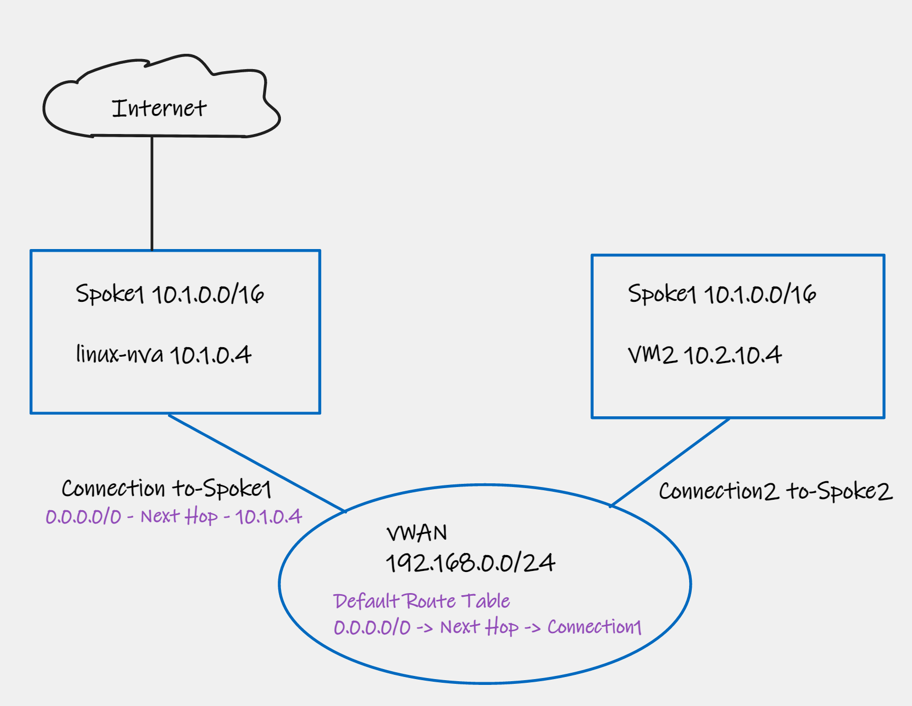

# Lab — NVA in DMZ Spoke for Internet Egress (Bicep IaC)

## Overview

This lab deploys a **Standard Azure Virtual WAN hub** (`10.100.0.0/23`) with two spoke VNets and a dedicated **DMZ VNet** that hosts an active/active pair of Ubuntu IPTables NVAs. The NVAs sit behind both an **Internal Load Balancer** (HA-port mode, frontend `10.0.0.68`) and a **Standard Public Load Balancer**. A static default route (`0.0.0.0/0`) on the hub's DMZ connection points to the ILB frontend, so all traffic leaving Spoke1 and Spoke2 egresses to the internet through the NVAs via SNAT on the Public LB. An **optional on-premises block** — a Linux VM plus a strongSwan/FRR NVA running BGP-over-IPsec — can be deployed at prompt time; it terminates a site-to-site VPN into a vHub VPN Gateway and learns Spoke1/Spoke2 routes via BGP. The entire lab is **Bicep IaC** with interactive Bash and PowerShell wrappers that handle hub polling and post-deploy routing steps that Bicep cannot safely sequence.

## Architecture



> 📐 **Editable diagram:** [`./media/nva-spoke-internet.excalidraw`](./media/nva-spoke-internet.excalidraw)
> - Open in **VS Code** with the [Excalidraw extension](https://marketplace.visualstudio.com/items?itemName=pomdtr.excalidraw-editor) (edits render inline).
> - Or go to **[excalidraw.com](https://excalidraw.com)** → *Menu → Open* and select the downloaded `.excalidraw` file.
> - Direct raw source (after push): [open raw file](https://raw.githubusercontent.com/dmauser/azure-virtualwan/dmauser-musical-guide/nva-spoke-internet/media/nva-spoke-internet.excalidraw)

## Address Plan

| Network | CIDR | Subnets |
|---------|------|---------|
| vWAN Hub | `10.100.0.0/23` | (managed) |
| DMZ VNet | `10.0.0.0/24` | `snet-nva` `10.0.0.0/26`, `snet-ilb` `10.0.0.64/26` |
| Spoke1 VNet | `10.1.0.0/24` | `snet-workload` `10.1.0.0/26` |
| Spoke2 VNet | `10.2.0.0/24` | `snet-workload` `10.2.0.0/26` |
| On-prem VNet _(optional)_ | `192.168.100.0/24` | `snet-nva` `192.168.100.0/27`, `snet-workload` `192.168.100.32/27` |

**Key IPs / ASNs**

| Resource | Value |
|----------|-------|
| ILB frontend (0/0 next-hop) | `10.0.0.68` |
| Hub VPN Gateway BGP ASN | `65515` |
| On-prem NVA BGP ASN | `65001` |

## How the Default Route Works

```
Spoke1 / Spoke2 VM
   |
   |  0.0.0.0/0 learned from hub defaultRouteTable
   v
vWAN Hub  --(static route 0/0 -> 10.0.0.68)-->  DMZ VNet connection
                                                       |
                                                       v
                                         Internal LB (HA ports, VIP 10.0.0.68)
                                                  |           |
                                                  v           v
                                               NVA-0       NVA-1   (active/active)
                                                  |           |
                                                  +-----+-----+
                                                        |
                                                        v
                                              Public Load Balancer
                                                        |
                                                        v  SNAT
                                                    Internet
```

**Route programming details:**

1. The hub `defaultRouteTable` contains a static route: `0.0.0.0/0` → next-hop type `ResourceID` → DMZ connection resource ID.
2. The DMZ VNet connection has a static route: `0.0.0.0/0` → next-hop IP `10.0.0.68` (ILB frontend).
3. Both Spoke1 and Spoke2 hub connections associate and propagate to `defaultRouteTable`, so they automatically learn the `0/0`.
4. The NVA subnet carries a UDR with `0.0.0.0/0 → Internet` so NVAs break out directly and are not caught by their own propagated default.
5. Cloud-init enables `ip_forward` and configures iptables `MASQUERADE` on each NVA NIC at first boot.

> ⚠️ **Hub routing sequencing**: Hub VNet connections and route-table programming are performed by the deploy script **after** `routingState = Provisioned`, not in Bicep. This is intentional — the Azure control plane rejects connection/route operations while the hub is still initialising.

## Optional On-Premises Connectivity

When you answer **y** at the `deployOnPrem?` prompt, the script additionally:

1. Deploys `bicep/modules/onprem.bicep` — an on-prem simulation VNet (`192.168.100.0/24`) containing a strongSwan/FRR NVA (with a Public IP) and a Linux workload VM. IP forwarding is enabled on the NVA NIC.
2. Deploys a **vHub VPN Gateway** (scale unit 1) inside the Virtual WAN Hub.
3. Creates a VPN site and connection (BGP, auto-generated PSK) between the hub GW and the on-prem NVA.
4. Runs `scripts/configure-onprem.sh` via `az vm run-command` to render and apply `ipsec.conf` + `frr.conf` on the on-prem NVA, using the hub GW public IPs, BGP peers, and PSK fetched from the deployment outputs.
5. Applies a UDR on `snet-workload` in the on-prem VNet so that traffic destined for Spoke1 (`10.1.0.0/24`), Spoke2 (`10.2.0.0/24`), and the hub prefix (`10.100.0.0/23`) is sent through the on-prem NVA.

After the tunnel comes up, the on-prem workload VM can reach Spoke1 and Spoke2 workload VMs over the BGP-over-IPsec path.

> 💡 **Cost note**: The VPN Gateway adds approximately **$0.19/hr** (scale unit 1). It is only deployed when you choose on-prem. Destroy the resource group when done.

## Prerequisites

| Tool | Minimum version | Install |
|------|----------------|---------|
| Azure CLI | 2.57 | [docs](https://learn.microsoft.com/cli/azure/install-azure-cli) |
| Bicep CLI | 0.26 | `az bicep install` |
| `jq` | 1.6 | `apt install jq` / `brew install jq` |
| `openssl` | 3.x | pre-installed on most Linux/macOS |
| PowerShell | 7.4+ _(PS wrapper only)_ | [docs](https://learn.microsoft.com/powershell/scripting/install/installing-powershell) |

A Bash shell (Linux, macOS, WSL2, or Azure Cloud Shell) is recommended. PowerShell 7+ on Windows is fully supported via `deploy.ps1`.

Ensure you have `Contributor` (or `Owner`) access on the target subscription and sufficient quota for:
- 1 Standard Virtual WAN hub + optional VPN Gateway (scale unit 1)
- 4 VMs minimum (2 NVAs + 2 spoke workload VMs); up to 6 VMs with on-prem option
- Standard Load Balancer (Public + Internal)

## Deployment

### Bash

```bash
cd nva-spoke-internet
./scripts/deploy.sh
```

The script prompts interactively:

| Prompt | Description | Default |
|--------|-------------|---------|
| `region` | Azure region for all resources | `eastus` |
| `adminUsername` | VM admin username | (required) |
| `adminPassword` | VM admin password (hidden input) | (required) |
| `deployOnPrem? [y/N]` | Deploy on-prem simulation block | `N` |

Before deploying, the script runs `pick_vm_sku` to find an available B-series VM size in the target region (`Standard_B2s` → `Standard_B2ms` → `Standard_D2s_v5` fallback) and exits cleanly if none are available. All VMs are deployed with **managed boot diagnostics** (no storage account) so Serial Console is available in the Azure portal immediately.

### PowerShell

```powershell
cd nva-spoke-internet
.\scripts\deploy.ps1
```

The PowerShell wrapper uses the same prompts and logic as the Bash script.

## Validation

### 1 — Check hub effective routes

After deployment, confirm the hub has programmed the default route correctly:

```bash
rg="rg-nva-spoke-internet"   # adjust if you changed the default
hubname="vhub-nva-spoke"

az network vhub show -g $rg -n $hubname --query 'routingState' -o tsv
# Expected: Provisioned

az network vhub route-table show \
  --resource-group $rg \
  --vhub-name $hubname \
  --name defaultRouteTable \
  --query 'routes[].{prefix:destinations,nextHop:nextHop}' -o table
# Expected: 0.0.0.0/0 entry with next-hop = DMZ connection resource ID
```

### 2 — Spoke VM internet egress

Connect to a spoke workload VM via **Serial Console** (Azure portal → VM → Serial Console) or SSH, then verify internet egress exits via the Public LB:

```bash
# From spoke workload VM
curl -s ifconfig.io
# Should return the Public LB frontend IP, not the VM's private IP
```

### 3 — Spoke VM effective routes

```bash
# Replace NIC name with actual value from deployment output
az network nic show-effective-route-table \
  --resource-group $rg \
  --name <spoke-vm-nic-name> -o table
# Look for: 0.0.0.0/0 | VirtualNetworkGateway (next-hop type from hub)
```

### 4 — On-prem to spoke reachability _(if on-prem deployed)_

```bash
# Verify tunnel state
az network vpn-connection show \
  --resource-group $rg \
  --name <vpn-connection-name> \
  --query 'connectionStatus' -o tsv
# Expected: Connected

# From on-prem workload VM (Serial Console)
ping 10.1.0.4   # Spoke1 workload VM
ping 10.2.0.4   # Spoke2 workload VM
```

> 📺 **Serial Console**: Boot diagnostics (managed, no storage account) are enabled on every VM at deploy time. Serial Console is available in the Azure portal for all VMs immediately after deployment.

### 5 — Trace the Internet breakout (end-to-end)

Use the **read-only** `validate-flow` scripts to gather all evidence that the Spoke VM → vHub → DMZ connection → ILB → NVA → Public LB → Internet path is wired correctly. The scripts never create or modify resources.

```bash
cd nva-spoke-internet
./scripts/validate-flow.sh               # Bash (Linux/macOS/WSL2/Cloud Shell)
```

```powershell
cd nva-spoke-internet
.\scripts\validate-flow.ps1              # PowerShell 7+
```

Both scripts accept `RESOURCE_GROUP` (env/param, default `rg-nva-spoke-internet`) and a hub name parameter (default `vhub-nva-spoke`).

#### What the scripts check

| Phase | Check | Evidence | Pass criterion |
|-------|-------|----------|---------------|
| 1 — Pre-checks | Hub `routingState` | `az network vhub show` | `Provisioned` |
| 2a — Control-plane | `defaultRouteTable` 0.0.0.0/0 route | `az network vhub route-table show` | Row with `0.0.0.0/0` present |
| 2b | `conn-dmz` static route | `az network vhub connection show` | `0.0.0.0/0 → 10.0.0.68` |
| 2c–2d | Spoke NIC effective routes | `az network nic show-effective-route-table` | `nextHopType = VirtualNetworkGateway` |
| 2e | vHub effective routes | `az network vhub get-effective-routes` | Command succeeds |
| 2f | NW next-hop | `az network watcher show-next-hop` | `VirtualNetworkGateway` |
| 2g | NW IP flow verify | `az network watcher test-ip-flow` | `Allow` |
| 2h | NW connectivity test | `az network watcher test-connectivity` | `Reachable` |
| 3 — Data-plane | `curl https://ifconfig.io` from vm-spoke1 + vm-spoke2 | `az vm run-command invoke` | Returned IP = Public LB PIP (`pip-lb-public`) |
| 4 — NVA evidence | iptables MASQUERADE hit counters | `run-command` → `iptables -t nat -L POSTROUTING` | Rule present |
| 4 | conntrack / ss | `conntrack -L \| head` | Non-fatal; printed for inspection |
| 4 | tcpdump (5 s, concurrent with spoke curl) | `tcpdump -ni any` on nva-dmz-0 | Captures packets |
| 5 — LB metrics | `UsedSNATPorts`, `AllocatedSNATPorts`, `SnatConnectionCount`, `ByteCount`, `PacketCount`, `DipAvailability`, `VipAvailability` on `lb-public`; `DipAvailability`, `ByteCount`, `PacketCount` on `lb-ilb` | `az monitor metrics list` | Printed for inspection (non-zero when lab has traffic) |

> ℹ️  When a spoke VNet is connected to a Virtual WAN hub, the spoke VM's `0.0.0.0/0` effective route shows `nextHopType = VirtualNetworkGateway` (the vHub BGP router). This is expected behaviour — the vHub router address (`10.100.x.68`) is the actual next-hop IP.
> Ref: [Effective routes in a virtual hub](https://learn.microsoft.com/azure/virtual-wan/effective-routes-virtual-hub) · [Manage route tables](https://learn.microsoft.com/azure/virtual-network/manage-route-table)

> ℹ️  **Network Watcher** checks (next-hop, IP flow verify, connectivity) require the regional Network Watcher to be enabled. The scripts flag these as WARN (not FAIL) when the watcher is absent.
> Ref: [Next hop overview](https://learn.microsoft.com/azure/network-watcher/network-watcher-next-hop-overview) · [IP flow verify](https://learn.microsoft.com/azure/network-watcher/network-watcher-ip-flow-verify-overview) · [Connectivity test](https://learn.microsoft.com/azure/network-watcher/network-watcher-connectivity-overview)

## Cleanup

### Bash

```bash
cd nva-spoke-internet
./scripts/cleanup.sh
```

### PowerShell

```powershell
cd nva-spoke-internet
.\scripts\cleanup.ps1
```

Both scripts delete the resource group and all contained resources. The cleanup is idempotent — re-running when the group is already gone exits cleanly.

## Monitoring & Logging

The core `validate-flow` scripts read existing Azure data with no side effects. If you need **persistent flow logs, Traffic Analytics, and LB metric streaming**, run the separate, optional `enable-monitoring` scripts. These provision extra resources that cost money — run them only when you need deeper observability, and delete the lab promptly when done.

### Run

```bash
cd nva-spoke-internet
./scripts/enable-monitoring.sh           # Bash
```

```powershell
cd nva-spoke-internet
.\scripts\enable-monitoring.ps1          # PowerShell 7+
```

Both accept `RESOURCE_GROUP` (env/param, default `rg-nva-spoke-internet`). They are **idempotent** — resources that already exist are skipped.

### What it creates

| Resource | Name | Notes |
|----------|------|-------|
| Log Analytics workspace | `log-nva-spoke-internet` | 30-day retention, same RG/region as lab |
| Storage account | `stnvaspk<sub-8-chars>` | Standard_LRS; stores raw flow log blobs |
| Network Watcher | `NetworkWatcher_<region>` | In `NetworkWatcherRG`; created if absent |
| VNet flow log | `flow-vnet-dmz` → `vnet-dmz` | Traffic Analytics enabled |
| VNet flow log | `flow-vnet-spoke1` → `vnet-spoke1` | Traffic Analytics enabled |
| VNet flow log | `flow-vnet-spoke2` → `vnet-spoke2` | Traffic Analytics enabled |
| LB diagnostic settings | `diag-lb-public` → workspace | AllMetrics for `lb-public` |
| LB diagnostic settings | `diag-lb-ilb` → workspace | AllMetrics for `lb-ilb` |

> ⚠️ **VNet flow logs, not NSG flow logs.** NSG flow logs are being **retired on September 30, 2027**. After **June 30, 2025** you cannot create **new** NSG flow logs. These scripts use VNet flow logs throughout.
> Ref: [Migrate from NSG flow logs](https://learn.microsoft.com/azure/network-watcher/nsg-flow-logs-migrate) · [VNet flow logs overview](https://learn.microsoft.com/azure/network-watcher/vnet-flow-logs-overview) · [Manage VNet flow logs](https://learn.microsoft.com/azure/network-watcher/vnet-flow-logs-manage)

> Ref: [Traffic Analytics](https://learn.microsoft.com/azure/network-watcher/traffic-analytics) · [Monitor Load Balancer](https://learn.microsoft.com/azure/load-balancer/monitor-load-balancer)

Data appears in Log Analytics **~10–20 minutes** after first traffic.

### KQL quickstart

Run these in **Azure portal → Log Analytics → Logs** (`log-nva-spoke-internet` workspace).

**Top internet-bound flows through NVAs** (Traffic Analytics — `AzureNetworkAnalytics_CL`):

```kql
AzureNetworkAnalytics_CL
| where TimeGenerated > ago(1h)
| where FlowType_s == "ExternalPublic"
| summarize TotalBytes=sum(todouble(BytesSentFromPublicIP_d)+todouble(BytesSentToPublicIP_d))
    by SrcIP_s, DestIP_s, DestPort_d
| top 20 by TotalBytes
```

**Public LB SNAT port usage** (LB diagnostic settings — `AzureMetrics`):

```kql
AzureMetrics
| where ResourceProvider == "MICROSOFT.NETWORK"
| where ResourceId has "lb-public"
| where MetricName in ("UsedSNATPorts","AllocatedSNATPorts","SnatConnectionCount")
| summarize avg(Average) by MetricName, bin(TimeGenerated, 1m)
| render timechart
```

Validated metric names (Standard LB, namespace `Microsoft.Network/loadBalancers`):
`UsedSNATPorts`, `AllocatedSNATPorts`, `SnatConnectionCount`, `ByteCount`, `PacketCount`, `DipAvailability`, `VipAvailability`
Ref: [LB metric reference](https://learn.microsoft.com/azure/load-balancer/monitor-load-balancer-reference) · [Troubleshoot outbound connections](https://learn.microsoft.com/azure/load-balancer/troubleshoot-outbound-connection)

### Cost note

| Component | Approximate cost |
|-----------|-----------------|
| Log Analytics ingestion | ~$2.76/GB (Pay-As-You-Go, 30-day retention) |
| Storage account (flow log blobs) | ~$0.018/GB/month |
| Traffic Analytics | ~$0.10 per 1,000 flows (beyond free tier) |

Keep the lab short-lived. To **disable Traffic Analytics only** (cheaper than deleting flow logs):

```bash
# Bash
for FL in flow-vnet-dmz flow-vnet-spoke1 flow-vnet-spoke2; do
  az network watcher flow-log update -n $FL -g NetworkWatcherRG \
    --traffic-analytics false --output none
done
```

```powershell
# PowerShell
@("flow-vnet-dmz","flow-vnet-spoke1","flow-vnet-spoke2") | ForEach-Object {
    az network watcher flow-log update -n $_ -g NetworkWatcherRG --traffic-analytics false --output none
}
```

To delete **all** lab resources (including monitoring): run `cleanup.sh` / `cleanup.ps1`.

## Files

```
nva-spoke-internet/
├── README.md                      # this file
├── .gitignore                     # ignores secrets (.deploy-pw) + deploy logs
├── bicep/
│   ├── main.bicep                 # RG-scoped orchestrator; wires all modules
│   ├── main.bicepparam            # sample parameter file
│   ├── main.json                  # compiled ARM template (Bicep output)
│   ├── cloud-init/
│   │   ├── nva.yaml               # NVA cloud-init: ip_forward, iptables MASQUERADE
│   │   ├── onprem-nva.yaml        # On-prem NVA cloud-init: strongSwan + FRR
│   │   └── workload.yaml          # Workload VM cloud-init: basic tooling
│   └── modules/
│       ├── vwan-hub.bicep         # Virtual WAN + hub; optional VPN Gateway (gated by deployOnPrem)
│       ├── dmz.bicep              # DMZ VNet + subnets (snet-nva, snet-ilb) + NSG
│       ├── nva.bicep              # 2x Ubuntu IPTables NVAs: NICs, cloud-init, IP forwarding
│       ├── public-lb.bicep        # Standard Public LB (outbound SNAT rule + optional inbound)
│       ├── internal-lb.bicep      # Standard Internal LB — HA port rule, frontend 10.0.0.68
│       ├── spoke.bicep            # Spoke VNet + workload VM + UDR (instantiated twice)
│       ├── vm.bicep               # Generic Ubuntu VM: managed boot diagnostics, Serial Console
│       └── onprem.bicep           # On-prem VNet + strongSwan/FRR NVA + workload VM + UDR
└── scripts/
    ├── functions.sh               # pick_vm_sku, preflight_vm_capacity, poll_until, logging helpers
    ├── deploy.sh                  # Bash: prompt -> preflight -> deploy -> hub poll -> routing -> on-prem
    ├── deploy.ps1                 # PowerShell: identical flow to deploy.sh
    ├── configure-onprem.sh        # Renders ipsec.conf + frr.conf; starts strongSwan + FRR via run-command
    ├── validate-flow.sh           # Bash: READ-ONLY 5-phase traffic-breakout validation
    ├── validate-flow.ps1          # PowerShell: parity with validate-flow.sh
    ├── enable-monitoring.sh       # Bash: OPTIONAL monitoring stack (LA + VNet flow logs + LB diags)
    ├── enable-monitoring.ps1      # PowerShell: parity with enable-monitoring.sh
    ├── cleanup.sh                 # Bash: idempotent resource-group deletion
    └── cleanup.ps1                # PowerShell: idempotent resource-group deletion
```

> 📐 Topology diagram source: [`./media/nva-spoke-internet.excalidraw`](./media/nva-spoke-internet.excalidraw)
