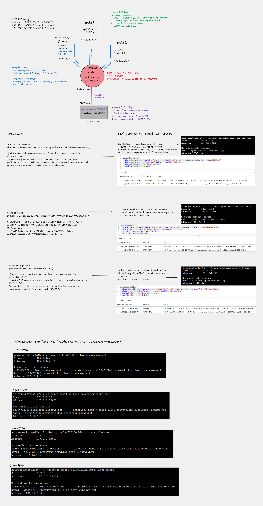

Lab: Azure Virtual WAN: Secured Virtual Hub (SVH)

Under construction...

Deployment script: 
```bash
wget -O svh-deploy.sh https://raw.githubusercontent.com/dmauser/azure-virtualwan/main/secured-vhub/svh-deploy.azcli
chmod +xr svh-deploy.sh
./svh-deploy.sh
```

For DNS Resolver scenario use file [dnsresolver.azcli](https://github.com/dmauser/azure-virtualwan/blob/main/secured-vhub/dnsresolver.azcli) commands inside the repo.

Draft of Lab outcome.


