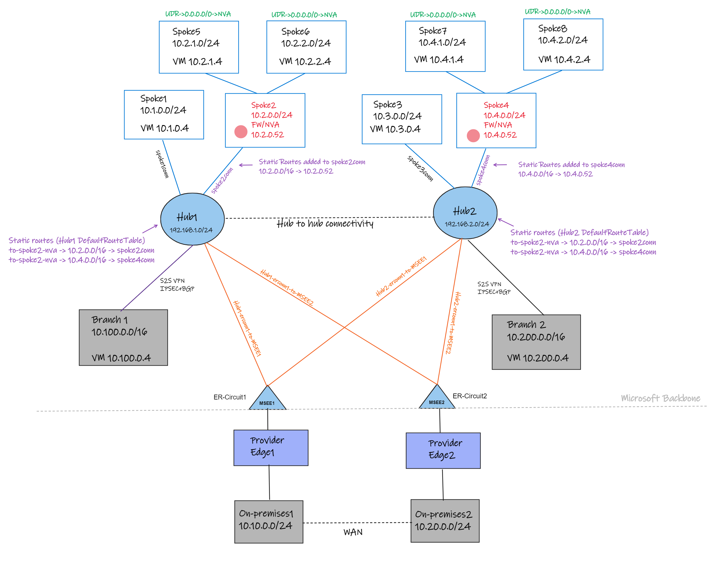

# Considerations when using vWAN static routes and ExpressRoute

_Under construction..._

## Intro

This post aims to review some scenarios you may encounter when leveraging static routes in Virtual WAN with inter-region vHubs and ExpressRoute cross-connected circuits.

### Network topology reference

## Background
