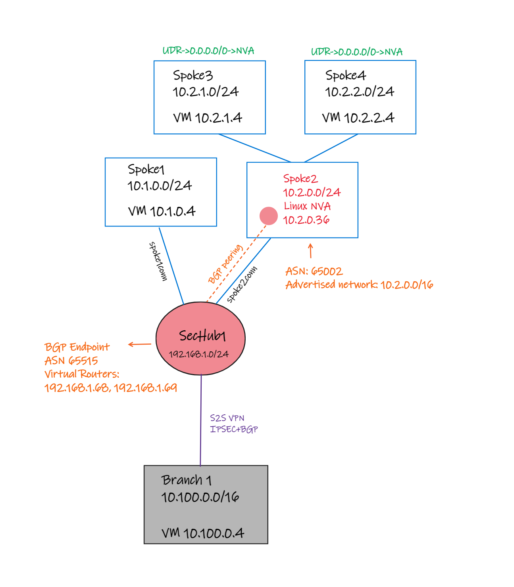

# Lab - Secured Virtual Hubs and BGP Endpoint

## Intro

TBD

## Network topology



## Considerations

TBD

## Deploy this solution

The lab is also available in the above .azcli that you can rename as .sh (shell script) and execute. You can open [Azure Cloud Shell (Bash)](https://shell.azure.com) and run the following commands to build the entire lab:

```bash
wget -O svhbgp-deploy.sh https://raw.githubusercontent.com/dmauser/azure-virtualwan/main/svh-bgp/svhbgp-deploy.azcli
chmod +xr svhbgp-deploy.sh
./svhbgp-deploy.sh
```

Please note that you must enable Secured-vHub via Firewall Manager after deployment.

### Default parameters:

```Bash
# Parameters (make changes based on your requirements)
region1=eastus2
rg=lab-svh-nvabgp
vwanname=vwan-svh-nvabgp
hub1name=sechub1
username=azureuser
password="Msft123Msft123" #Please change your password
vmsize=Standard_DS1
```