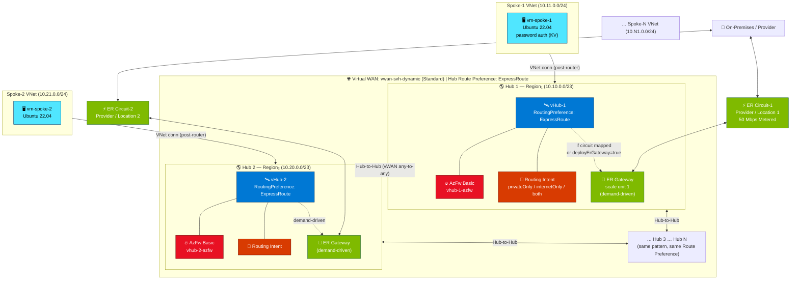

# Lab — Dynamic Secured Virtual WAN with ExpressRoute & Routing Intent

## Intro

This lab deploys a **Standard Azure Virtual WAN** with **one to N secured Virtual Hubs** — the number of hubs is driven entirely by user input at deploy time, making it a reusable building block for any topology size. Every hub is a **Secured Hub** backed by **Azure Firewall Basic**, a per-hub firewall policy with a lab-only allow-all rule, and **Routing Intent** in your chosen mode (`privateOnly`, `internetOnly`, or `both`). The deployment is Bicep-primary (RG-scoped `main.bicep` + modules) with interactive PowerShell and Bash wrappers that handle the steps Bicep cannot sequence safely — Routing Intent, ExpressRoute circuit↔gateway association, and spoke hub connections.

> ⚠️ **LAB-ONLY FIREWALL RULE**: Every hub's firewall policy contains a rule collection group (`default-allow-all-rcg`) with an **Allow-All network rule** (any source → any destination, any protocol, any port). This allows all traffic flows — spoke-to-spoke, inter-hub, branch-to-spoke, branch-to-branch, and outbound Internet — without rule editing during tests. **This configuration is not production-safe and must never be used outside a lab environment.**

> 📍 **ROUTE PREFERENCE = EXPRESSROUTE**: Every Virtual Hub in this lab is created with `hubRoutingPreference = ExpressRoute`. This means ExpressRoute-learned routes always win over VPN-learned routes when equal-cost paths exist. This is hard-coded in `vhub.bicep` and asserted by the validation scripts. Do not change it without understanding the BGP routing implications.

## Network Topology



### Address Plan

The address plan is deterministic and scales with hub count:

| Index (i) | Hub address    | Spoke address  |
|-----------|---------------|----------------|
| 1         | 10.10.0.0/23  | 10.11.0.0/24   |
| 2         | 10.20.0.0/23  | 10.21.0.0/24   |
| 3         | 10.30.0.0/23  | 10.31.0.0/24   |
| 4         | 10.40.0.0/23  | 10.41.0.0/24   |
| N         | 10.(N×10).0.0/23 | 10.(N×10+1).0.0/24 |

VM subnet within each spoke: first /27 (e.g., `10.11.0.0/27` for spoke-1).

### Per-Hub Components

| Component | Detail |
|-----------|--------|
| Virtual Hub | Standard SKU, `hubRoutingPreference = ExpressRoute` |
| Azure Firewall | Basic SKU (`AZFW_Hub`), 1 managed public IP |
| Firewall Policy | Basic tier, per-hub; RCG `default-allow-all-rcg` → collection `allow-all-network` → rule `allow-all` (Action: Allow, Source: \*, Dest: \*, Protocol: Any, Port: \*) |
| Routing Intent | `privateOnly` / `internetOnly` / `both`; next hop = hub Azure Firewall |
| ER Gateway | Scale unit 1 (lowest cost); created only when a circuit maps to the hub or `deployErGateway = true` |
| Spoke VNet | /24, VM subnet /27; NSG allows inbound SSH from deployer IP only |
| Spoke VM | Ubuntu 22.04 LTS Gen2 (`Standard_B2s` default); username/password auth (password auto-generated, stored in Key Vault); no public IP; Serial Console enabled |

## Considerations

- **Route Preference = ExpressRoute**: All hubs use `hubRoutingPreference = ExpressRoute`. When the same prefix is advertised by both an ExpressRoute circuit and a VPN gateway (or another attachment), the ExpressRoute-learned path wins. This is intentional for ER-centric lab designs. If your test requires ASPath or VpnGateway preference, you must modify `vhub.bicep`. The validation scripts assert `ExpressRoute` and will flag any deviation.

- **Azure Firewall Basic SKU**: Basic tier does not support Threat Intelligence, IDPS, TLS inspection, or advanced SNAT. It is appropriate here because the goal is Routing Intent traffic steering, not deep packet inspection. For labs needing inspection features, upgrade to Standard or Premium SKU.

- **Routing Intent + Internet traffic + Basic SKU**: Azure Firewall Basic has documented limitations when steering Internet traffic in secured-hub mode via Routing Intent. If you enable `internetOnly` or `both` mode and observe Internet traffic not flowing as expected, upgrade to Azure Firewall Standard or Premium. The `privateOnly` mode works reliably with Basic.

- **LAB-ONLY allow-all policy**: The firewall policy's `default-allow-all-rcg` rule collection group permits **everything** through the firewall. This means zero traffic blocking by default. Its sole purpose is to let you trace routing behaviour without wrestling with firewall rules during lab sessions. **Remove or replace this rule collection before any non-lab use.**

- **ER gateways are demand-driven**: An ER gateway is created on a hub only when a circuit is mapped to it (interactive script prompts) or the hub has `deployErGateway = true`. Hubs with no ER requirement avoid the gateway cost entirely.

- **ER provider provisioning**: Creating an ER circuit is fast (seconds); the provider then takes hours-to-days to provision its side. The deploy scripts print the service key(s) early and pause so you can hand them to the provider, then overlap Azure infrastructure work and poll `serviceProviderProvisioningState` before gateway creation.

- **VM SKU availability**: The deploy scripts check SKU availability in each spoke region before creating any resources. Candidates in preference order: `Standard_B2s`, `Standard_D2s_v5`, `Standard_D2s_v3`. If none are available in a region the script exits cleanly before deployment starts.

- **No public IP on VMs**: VMs have no public IP by default. Access via Azure Serial Console (use the Key Vault-stored password) or VM-to-VM SSH within the lab using the password.

- **Cost**: This lab can be expensive with multiple hubs. See [`docs/cost-control.md`](docs/cost-control.md) for line-item cost breakdown and ways to minimize spend. **Always run the cleanup script when done.**

## Prerequisites

- Azure CLI ≥ 2.57 (or Azure Cloud Shell)
- PowerShell 7+ with `Az` module (for PowerShell wrapper)
- `Contributor` or `Owner` role on the target subscription
- ExpressRoute provider account (Megaport, Equinix, etc.) if ER circuits are needed
- Sufficient subscription quota for: Azure Firewall Basic × N, Standard vWAN, Standard VMs × N

## Deploy with Bash

Open [Azure Cloud Shell (Bash)](https://shell.azure.com) or a local Bash terminal with Azure CLI:

```bash
# Interactive — prompts for hub count, regions, RI mode, ER circuits, etc.
./deploy.sh

# Non-interactive example — 2 hubs, private-only, no ER circuits
./deploy.sh \
  --hub-count 2 \
  --regions "eastus,westus" \
  --routing-intent-mode privateOnly \
  --skip-er
```

After deployment the script prints a summary of all hub names, spoke VNet names, VM private IPs, Key Vault name, and ER service keys (if circuits were created).

### ER Service Key Handoff (if circuits were created)

The script prints each circuit's service key and pauses. Copy the keys into your provider portal (e.g., Megaport VXC orders), then press **ENTER**. The script continues Azure infra work and later polls `serviceProviderProvisioningState` before wiring ER gateways and connections.

### Resume After Poll Timeout

If provider provisioning exceeds the poll timeout (`MAX_WAIT_MIN`, default 180 minutes), the script exits with a resume message. Once circuits reach `Provisioned`, re-run with `--resume` or manually execute the ER gateway / connection phases from the script.

## Deploy with PowerShell

```powershell
# Interactive — prompts for all required inputs
.\deploy.ps1

# Non-interactive example — 3 hubs, both private + internet, with ER on hub 1
.\deploy.ps1 `
  -HubCount 3 `
  -Regions @("eastus","westus","centralus") `
  -RoutingIntentMode both `
  -ErHubs @(1) `
  -ErProvider "Megaport" `
  -ErPeeringLocations @("Washington DC")
```

## Validate

```bash
# Bash
./validate.sh

# PowerShell
.\validate.ps1
```

The validate scripts check:
- Hub `hubRoutingPreference = ExpressRoute` on all hubs
- Routing Intent provisioning state per hub
- Firewall provisioning state per hub
- Spoke VNet connection status per hub
- VM private IPs and reachability
- VM effective routes (should show 0.0.0.0/0 and/or RFC-1918 prefixes via hub firewall)
- ER circuit and connection provisioning state (if applicable)
- Key Vault secret existence (`vm-admin-username`, `vm-admin-password`)

See [`docs/validation.md`](docs/validation.md) for detailed test procedures.

## Operational Scripts

Helper scripts for day-to-day testing. All are interactive (they prompt for
anything they need) and run from the `scripts/` folder. Copy and paste:

### Connectivity test (timestamped ping)

Prompts for a target IP/host and pings it on a loop, printing one timestamped
line per probe. Press `Ctrl+C` to stop and print a sent/received/loss + rtt
summary. Useful for watching connectivity converge while ER circuits, Routing
Intent or firewall rules come up.

```bash
# Bash — prompts for the target IP
./test-connectivity.sh

# Specify the target inline, ping every 2s, also log to a file
./test-connectivity.sh -t 10.10.1.4 -i 2 -l ./la-test.log
```

```powershell
# PowerShell — prompts for the target IP
.\test-connectivity.ps1

# Specify the target inline, ping every 2s, also log to a file
.\test-connectivity.ps1 -Target 10.10.1.4 -IntervalSeconds 2 -LogFile .\la-test.log
```

### Dump / change Hub Route Preference

Dumps the current `hubRoutingPreference` for **every** Virtual Hub in the
resource group, then optionally changes them all to a target preference and
re-checks that the change took effect. Default target is `ASPath`.

> ⚠️ This lab defaults to **Route Preference = ExpressRoute** (hard-coded in
> `vhub.bicep`, asserted by the validation scripts). Switching to `ASPath` is a
> runtime-only override for BGP AS-path testing — it does **not** change the
> Bicep, and re-running `deploy`/`validate` will report or restore ExpressRoute.

```bash
# Bash — dump only (no changes)
./set-hub-routing-preference.sh -g rg-svhdyn-4hub --dump-only

# Change ALL hubs to ASPath (prompts to confirm, then re-checks)
./set-hub-routing-preference.sh -g rg-svhdyn-4hub --preference ASPath

# Change back to ExpressRoute without prompting
./set-hub-routing-preference.sh -g rg-svhdyn-4hub --preference ExpressRoute --yes

# Change only selected hubs (comma/space list of names or suffixes), leave the rest untouched
./set-hub-routing-preference.sh -g rg-svhdyn-4hub --preference ASPath --hubs "vhub1,vhub2,vhub4" --yes
```

```powershell
# PowerShell — dump only (no changes)
.\set-hub-routing-preference.ps1 -ResourceGroup rg-svhdyn-4hub -DumpOnly

# Change ALL hubs to ASPath (prompts to confirm, then re-checks)
.\set-hub-routing-preference.ps1 -ResourceGroup rg-svhdyn-4hub -Preference ASPath

# Change back to ExpressRoute without prompting
.\set-hub-routing-preference.ps1 -ResourceGroup rg-svhdyn-4hub -Preference ExpressRoute -Yes

# Change only selected hubs (comma/space list of names or suffixes), leave the rest untouched
.\set-hub-routing-preference.ps1 -ResourceGroup rg-svhdyn-4hub -Preference ASPath -Hubs "vhub1,vhub2,vhub4" -Yes
```

> The `-Hubs` / `--hubs` option (default `all`) accepts a comma- or space-separated list of
> full hub names or suffixes (e.g. `vhub1,vhub2,vhub4`). Only the matched hubs are changed;
> all others keep their current Route Preference. Omit it to target every hub.

### Route dump (ER circuits / vHubs / VMs)

Interactive, read-only route-dump tool: ExpressRoute circuit routes, Virtual Hub
Azure Firewall effective routes (the portal "Effective Routes / Azure Firewall"
view, plus the hub's current Route Preference), and VM NIC effective routes.

```bash
# Bash — interactive menu
./dump-routes.sh -g rg-svhdyn-4hub
```

```powershell
# PowerShell — interactive menu
.\dump-routes.ps1 -ResourceGroup rg-svhdyn-4hub
```

```bash
# Non-interactive examples (pick a component / target up front)
./dump-routes.sh -g rg-svhdyn-4hub --component vhub --target vwanlab-vhub1 --non-interactive
.\dump-routes.ps1 -ResourceGroup rg-svhdyn-4hub -Component vm -Target vwanlab-vm1 -NonInteractive
```

> **Route Preference (ExpressRoute / ASPath) is fully supported.** The vHub dump
> shows each hub's current Hub Route Preference and the Azure Firewall effective
> routes in either mode. Because `get-effective-routes` is an async operation that
> can briefly return an empty set right after a preference change (while routes
> reprogram), the vHub and VM queries **auto-retry** until routes appear. Tune with
> `-MaxAttempts` / `-RetryDelaySec` (PowerShell) or `--max-attempts` / `--retry-delay`
> (Bash); defaults are 4 attempts, 20s apart.

## Cleanup

```bash
# Bash
./cleanup.sh

# PowerShell
.\cleanup.ps1
```

> ⚠️ The cleanup scripts delete the entire resource group, which includes all ER circuits. Remove any provider-side VXCs or cross-connects **before** running cleanup to avoid orphaned charges on the provider side.

See [`docs/cost-control.md`](docs/cost-control.md) for staged cleanup options (e.g., deallocate VMs only, skip circuit deletion, remove ER gateways).

## Parameters

| Parameter | Type | Default | Description |
|-----------|------|---------|-------------|
| `hubCount` | int | 1 | Number of secured vHubs to deploy (1–N). |
| `regions` | string[] | `["eastus"]` | Azure region per hub, one entry per hub. |
| `routingIntentMode` | string | `privateOnly` | `privateOnly`, `internetOnly`, or `both`. Applies to all hubs. |
| `erCircuits` | object[] | `[]` | ER circuit definitions (provider, peeringLocation, bandwidthMbps). |
| `erHubs` | int[] | `[]` | 1-based hub indices that should receive an ER gateway. |
| `deployErGateway` | bool[] | per hub `false` | Override: explicitly deploy ER gateway on a hub regardless of circuits. |
| `sshPublicKey` | string | `""` | Optional SSH public key. Unused by default — VMs use password auth. |
| `adminUsername` | string | dynamic | Generated at deploy time; stored in Key Vault as `vm-admin-username`. |
| `vmSize` | string | auto | Auto-selected from `Standard_B2s`, `Standard_D2s_v5`, `Standard_D2s_v3`. |
| `labName` | string | `svh-dynamic-er-ri` | Applied as tag `labName` on all resources. |
| `owner` | string | deployer UPN | Applied as tag `owner` on all resources. |
| `resourceGroup` | string | `lab-svh-dynamic-er-ri` | Resource group to deploy into. |
| `maxWaitMinutes` | int | 180 | ER provider poll timeout in minutes. |

All resources receive the tags: `labName`, `owner`, `purpose`, `environment`, `createdBy`.

## Examples

### Single vHub (no ER, private-only)

```bash
./deploy.sh \
  --hub-count 1 \
  --regions "eastus" \
  --routing-intent-mode privateOnly \
  --skip-er
```

### Three vHubs (default regions, private-only, no ER)

```bash
./deploy.sh \
  --hub-count 3 \
  --regions "eastus,westus,centralus" \
  --routing-intent-mode privateOnly \
  --skip-er
```

### Four vHubs, custom regions

```bash
./deploy.sh \
  --hub-count 4 \
  --regions "eastus,westus,northeurope,southeastasia" \
  --routing-intent-mode privateOnly \
  --skip-er
```

### Private-only Routing Intent

```bash
./deploy.sh --hub-count 2 --regions "eastus,westus" \
  --routing-intent-mode privateOnly --skip-er
```

### Internet-only Routing Intent

> ⚠️ Internet mode with Azure Firewall Basic has known limitations in secured-hub Routing Intent scenarios. Verify traffic flows after deployment.

```bash
./deploy.sh --hub-count 2 --regions "eastus,westus" \
  --routing-intent-mode internetOnly --skip-er
```

### Both (private + internet) Routing Intent

```bash
./deploy.sh --hub-count 2 --regions "eastus,westus" \
  --routing-intent-mode both --skip-er
```

### ER Gateway Only on Selected Hubs (hubs 1 and 3, no circuits yet)

```powershell
.\deploy.ps1 `
  -HubCount 3 `
  -Regions @("eastus","westus","centralus") `
  -RoutingIntentMode privateOnly `
  -DeployErGateway @($true, $false, $true) `
  -SkipErCircuits
```

### Three vHubs with ER Circuits (interactive ER handoff)

```bash
./deploy.sh \
  --hub-count 3 \
  --regions "eastus,westus,centralus" \
  --routing-intent-mode privateOnly \
  --er-provider "Megaport" \
  --er-peering-locations "Washington DC,Silicon Valley" \
  --er-hubs "1,2"
```

## Validation Steps

1. **Check hub routing preference** — all hubs must show `ExpressRoute`:
   ```bash
   az network vhub list -g lab-svh-dynamic-er-ri \
     --query "[].{name:name, pref:hubRoutingPreference}" -o table
   ```

2. **Check Routing Intent** — each hub should show `Succeeded`:
   ```bash
   az network vhub routing-intent show \
     -g lab-svh-dynamic-er-ri --vhub-name vhub-1 -n vhub-1-ri \
     --query "provisioningState" -o tsv
   ```

3. **Check VM effective routes** — verify 0.0.0.0/0 and/or RFC-1918 show next hop through the hub firewall:
   ```bash
   az network nic show-effective-route-table \
     -g lab-svh-dynamic-er-ri -n nic-vm-spoke-1 -o table
   ```

4. **Connectivity test** — SSH to vm-spoke-1 and trace to vm-spoke-2:
   ```bash
   traceroute 10.21.0.4   # adjust to actual VM IP
   ```
   Use the password from Key Vault to log in via Serial Console or VM-to-VM SSH.
   The trace should show an intermediate hop through the Azure Firewall private IP.

See [`docs/validation.md`](docs/validation.md) for the full validation checklist.

## Troubleshooting

See [`docs/troubleshooting.md`](docs/troubleshooting.md) for common issues including:
- ER provider provisioning delays (hours to days — expected)
- Firewall provisioning time (~30–45 min — expected)
- Routing Intent `routingState` not `Provisioned`
- Internet traffic not routing through Firewall Basic
- VM access via Serial Console (use Key Vault password)
- VM SKU quota restrictions per region

## Cost Notes

> ⚠️ This lab can incur significant charges. **Delete the resource group when done.**

The highest-cost components are:

| Resource | Approximate cost driver |
|----------|------------------------|
| ExpressRoute Gateway | ~$0.073/hr per scale unit per hub (even idle) |
| ExpressRoute Circuit | Monthly port fee + metered egress |
| Azure Firewall Basic | ~$0.246/hr per hub |
| Standard Virtual Hub | ~$0.25/hr per hub |
| VMs (Standard_B2s) | ~$0.042/hr per VM |

**Cost minimization tips:**
- Skip ER gateways on hubs that don't need circuit connectivity (`--skip-er` flag)
- Deallocate VMs when not actively testing
- Use `Standard_B2s` (default) — smallest practical size
- Delete the lab immediately after each session (`./cleanup.sh`)

See [`docs/cost-control.md`](docs/cost-control.md) for detailed guidance.
