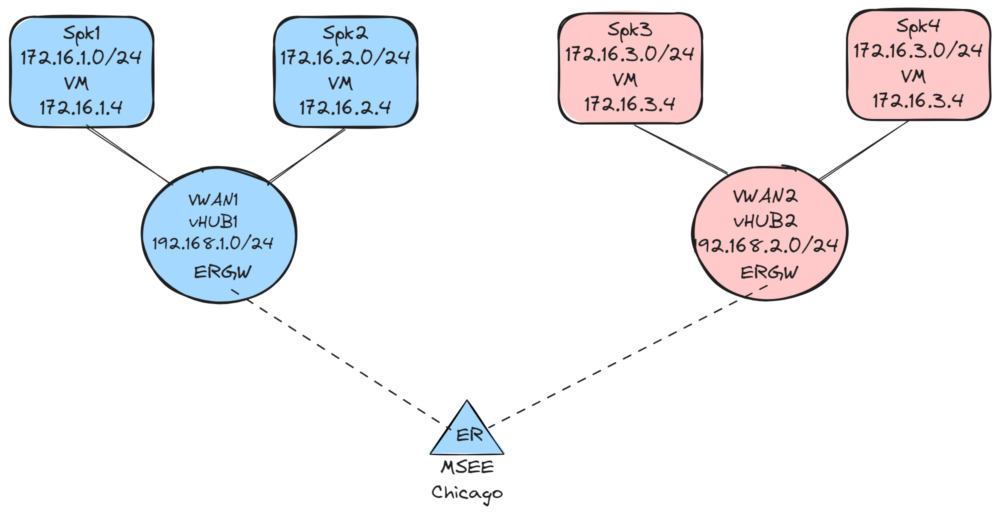

## Intro

This lab aims to build a two Virtual WANs with two vHubs (one for each), two Spokes for each vHUB, and both vHubs interconnect them over ExpressRoute.

## Lab Diagram



## Deploy this solution

Deploy this Lab using this CLI script: [deploy.azcli](./deploy.azcli), or run the following command:

```bash
curl -s https://raw.githubusercontent.com/dmauser/azure-virtualwan/main/two-vwans/deploy.azcli | bash
```

- CLI is in bash format. Please run the script using Azure Cloud Shell Bash or Azure CLI for Linux. This script does not work over Azure CLI for Windows (command prompt or PowerShell).

- Default username and password for the VMs are (you can change on under parameters inside the script file):
  - username: azureuser
  - password: Msft123Msft123

- All VM's are assessable using Serial Console via Azure Portal