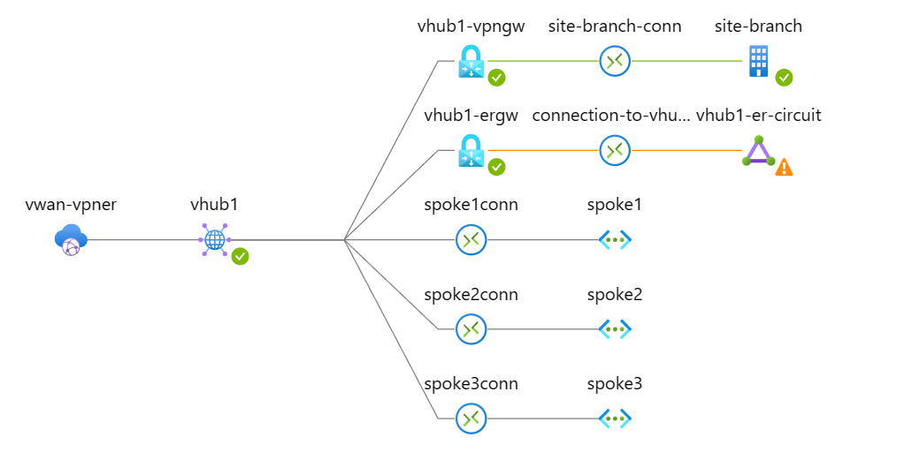
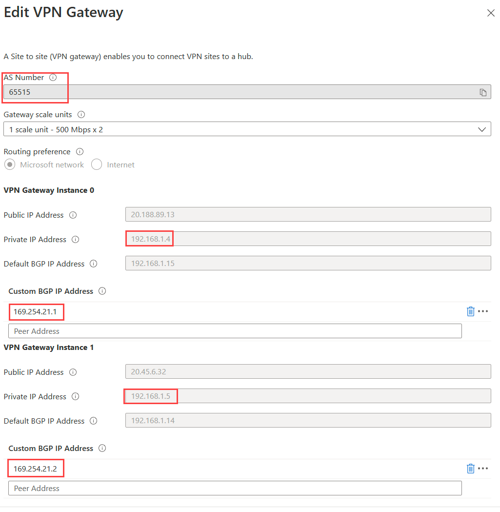
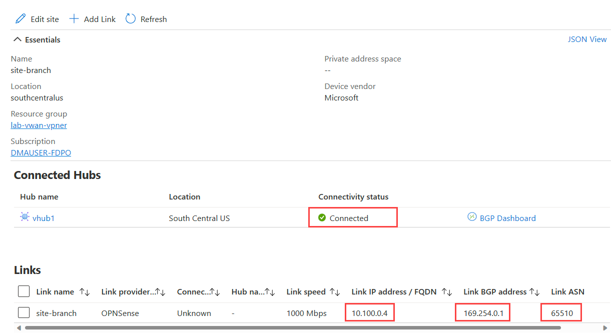
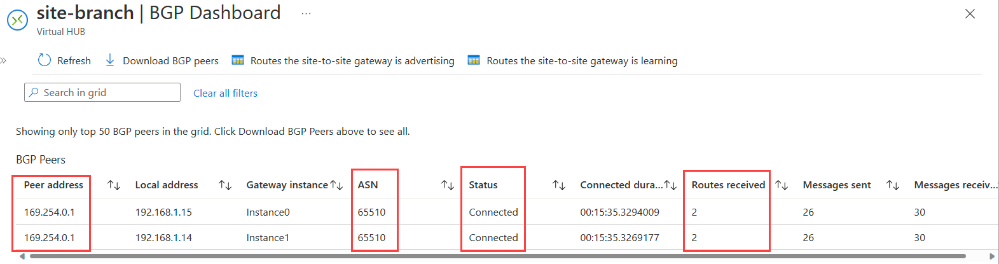
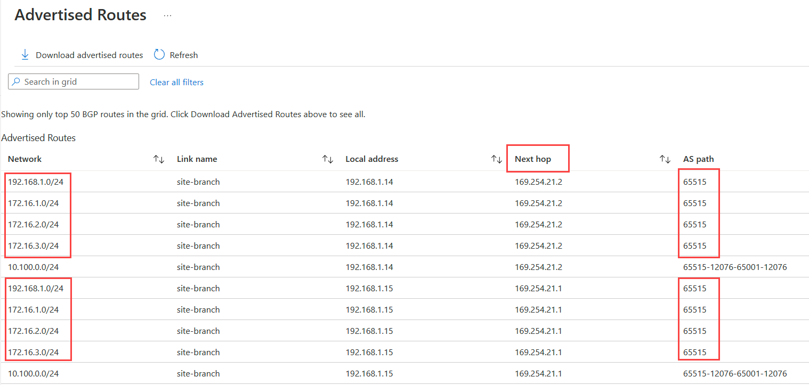
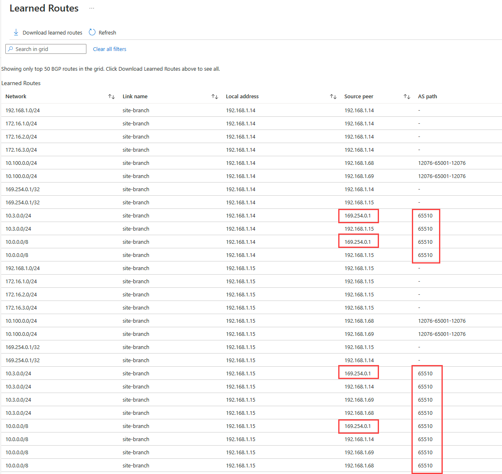
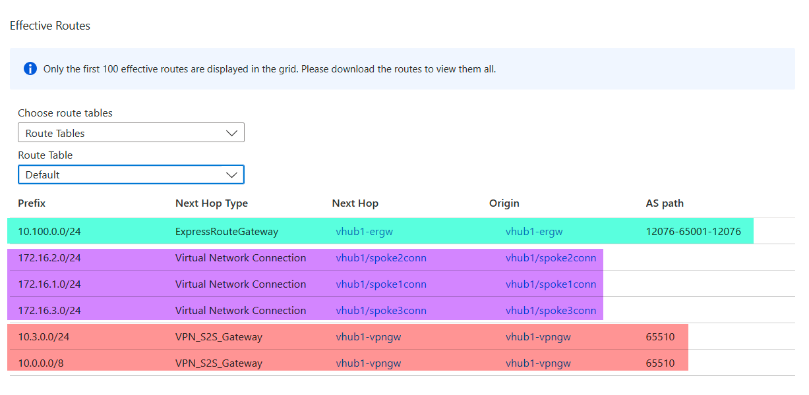
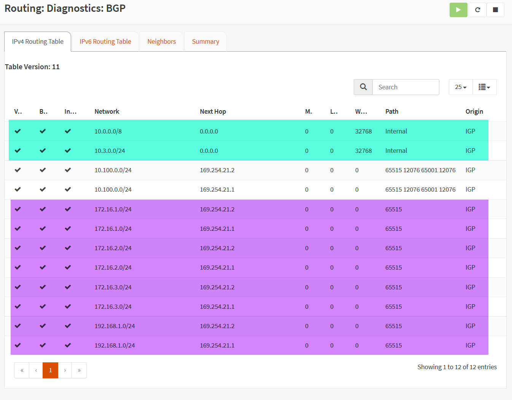

# Lab - Virtual WAN Scenario: IPsec VPN over ER

## Intro

The goal of this lab is to validate IPSec over Express Route using Virtual WAN leveraging only Azure to emulate On-premises.
You can find the official Microsoft reference for that functionality in [ExpressRoute encryption](https://learn.microsoft.com/en-us/azure/virtual-wan/vpn-over-expressroute): IPsec over ExpressRoute for Virtual WAN](https://learn.microsoft.com/en-us/azure/virtual-wan/vpn-over-expressroute)

## Lab diagram


## Considerations and requirements

- An on-premises emulated in Azure using two networks 10.100.0.0/24 and 10.3.0.0/24.
- This solution requires two ExpressRoute (ER) circuits connected via an ER Service Provider. This lab uses Megaport and MCR (Megaport Cloud Router) and connected both circuits to the same MCR (ASN 65001).
- An Extended-Branch with prefix range 10.3.0.0/24 was created to avoid the routing leaking over ExpressRoute. Therefore, there's no need to configure route filters.
 - The Extended-Branch has a UDR 0.0.0.0/0 next hop to the OPNsense internal interface (10.100.0.20).
- The Branch (10.100.0.0/24) has an NVA OPNsense preconfigured with S2S VPN reaching both vWAN VPN Gateway instances using private IPs 192.168.1.4 and 192.168.1.5.
 - Note that **OPNsense** used as VPN Server has **username:root** and **password:opnsense** and its accessible via HTTPS over its public IP associated with the untrusted NIC.
 - A BGP session is configured between the VTI interfaces (10.200.0.1) and both vWAN VPN Gateway instances BGP IPs 192.168.1.14 and 192.168.1.15.  **Note** that VPN GW BGP IPs may be different during your provisioning. There are cases that those IPs can be set to 192.168.1.12 and 192.168.1.13.
  - OPNSense advertises 10.3.0.0/24 and 10.0.0.0/8 and has ASN set to 65510.
- All VMs are Linux Ubuntu accessible via SSH restricted by your Public IP (see $mypip parameter) or using Serial Console.

## Deploy this solution

The lab is also available in the above .azcli that you can rename as .sh (shell script) and execute. You can open [Azure Cloud Shell (Bash)](https://shell.azure.com).

Review the parameters below and make changes based on your needs:

```Bash
#Parameters
region=southcentralus
rg=lab-vwan-vpner
vwanname=vwan-vpner
hubname=vhub1
username=azureuser
password="Msft123Msft123" #Please change your password
vmsize=Standard_B1s #VM Size
mypip=$(curl -4 ifconfig.io -s) #Replace with your home Public IP in case you run this over Cloudshell
```

Note that **OPNsense** used as VPN Server has **username:root** and **password:opnsense**


Please, run the following steps to build the entire lab:

### Step 1 - Deploy the Lab

```bash
wget -O vwan-vpner-deploy.sh https://raw.githubusercontent.com/dmauser/azure-virtualwan/main/vpn-over-er/vpner-deploy.azcli
chmod +xr vwan-vpner-deploy.sh
./vwan-vpner-deploy.sh
```

### Step 2 - Provision ER Circuits with the Provider

Ensure that ExpressRoute Circuits er-circuit-vhub1 and er-circuit-branch are provisioned. That is required to connect them to the respective ER Gateways in Step 3.

### Step 3 - Connect ER Circuits to respective ER Gateway

In this step, the script below connect branch-er-circuit to the Branch ER Gateway and vhub1-er-circuit to the vHub ER Gateway.

```bash
wget -O vwan-vpner-conn.sh https://raw.githubusercontent.com/dmauser/azure-virtualwan/main/vpn-over-er/vpner-conn.azcli
chmod +xr vwan-vpner-conn.sh
./vwan-vpner-conn.sh
```

## Validation

In the below sections, we have a breakdown of the vWAN configuration highlighting some important points of this solution.

### Azure Virtual WAN

#### Topology

Via the networking insights, we can get a good view of the vWAN topology and its components.




#### VPN Gateway configuration

VPN Gateways, a special highlight for the Private IP addresses and the default BGP IP Address. For NAT you must use Default BGP IP addresses. It does not work with Custom BGP IP addresses listed below as APIPA.



#### VPN Site connection

This screen shows the VPN Site with the connection reaching over OPNsense private IP 10.100.0.4 where the IPSec tunnel is terminated and BGP private IP 10.200.0.1 is associated with the IPSec interface.



#### VPN Gateway BGP Dashboard

1. BGP peer status

There are two BGP sessions over IPSec with the remote OPNSense BGP IP 10.200.0.1 as shown:



2. VPN Gateway advertised routes

The connected Spoke4 VNET which has 10.3.0.0/24 will be advertised as 100.64.1.0/24 as shown:



3. VPN Gateway learned routes

- 10.3.0.0/24 is a local route entry that represents the Spoke4 VNET.
- 100.64.2.0/24 represents NAT for the extended branch 10.3.0.0/24. You will see multiple times this entry because there's a BGP peer between both VPN Gateway instances (192.168.1.14 and 192.168.1.15), vHUB Virtual Router instances (192.168.1.68 and 192.168.1.69). Also, the source peer is the VPN Gateway instances themselves. That is expected because VPN Gateway is responsible for the translation based on the extbranch IngressSnat rule observed on the NAT rules above.
- 10.0.0.0/8 is a summary advertised by the on-premises OPNsense via BGP with AS path 65510.



#### vHub Effective Routes

1. **100.64.2.0/24** is the extended branch 10.3.0.0/24 translated prefix.
2. OPNSense also advertises **10.0.0.0/8** prefix via BGP and you can see the AS path 65510.
3. The Spoke4 VNET **10.3.0.0/24** has a VNET connection entry as expected.



### OPNSense 

#### BGP configuration

- Below we have the full dump of the OPNsense BGP configuration:

```Text
```

#### BGP route table

In the screenshot below you can see Spoke 4 original prefix 10.3.0.0/24 comes as 100.64.1.0/24 translated by BGP on the Azure VPN Gateway side based on the [NAT rule configuration](#vhub-vpn-gateway-nat-rules).



### Connectivity

#### Summary

| Source | Destination | Path | What destination sees as source IP |
|------|------|------|------|
| ExtBranchVM (10.3.0.4) | Spoke1VM (10.3.0.4) | IPSec over ER |  
| ExtBranchVM (10.3.0.4) | Spoke1VM (172.16.1.4)  | IPSec over ER |
| ExtBranchVM (10.3.0.4) | Spoke2VM (172.16.2.4)  | IPSec over ER |
| ExtBranchVM (10.3.0.4/) | Spoke3VM (172.16.2.4)  | IPSec over ER |
| BranchVM (10.100.0.100) | Spoke1VM (172.16.1.4)  | ER | 10.100.0.100 |
| BranchVM (10.100.0.100) | Spoke2VM (172.16.2.4)  | ER | 10.100.0.100 |
| BranchVM (10.100.0.100) | Spoke3VM (172.16.3.4)  | ER | 10.100.0.100 |


(1) - You can propagate 10.100.0.0/24 over VPN and BranchVM will be able to reach Spoke1VM using IPSec over ER.

#### VM connectivity test example

From Extended Branch VM (10.3.0.4) to Azure Spoke1 VM (172.16.1.4) and Spoke4 VM ().

```Bash

```

Below is what Spoke1 VMs receives based on the tcpdump capture. You can see extended branch VM arrives with IP **** because of the NAT rule processed by vWAN VPN Gateway.

```Bash

```

In the same way, here is what Spoke1VM (10.3.0.4/) receives from extended branch VM (10.3.0.4/).

```Bash

```

##### How to know if traffic goes over ER only or IPSec VPN over ER?

There are complex or simpler ways to determine where the traffic between on-premises and Azure goes. The complex way is to take multiple captures in the OPNsense, VPN Gateways, as well as source and target VMs. However, I will explain the simplest way which is just taking a look at the ICMP TTL using a simple ping test.

In the previous example, you see NAT is triggered only using IPsec VPN and it will show a higher **TTL** which is **63**. When traffic goes over ER it will decrement **TTL to 60** based on the number of hops that the traffic goes thru.

Here is an example when Spoke1VM reaches extended branchvm (10.3.0.4/NAT IP ) and branchvm (10.100.0.100) and you will see **TTL is 60** because it goes over multiple hops (customer router, provider, ER Gateways, etc.).

```Bash

```